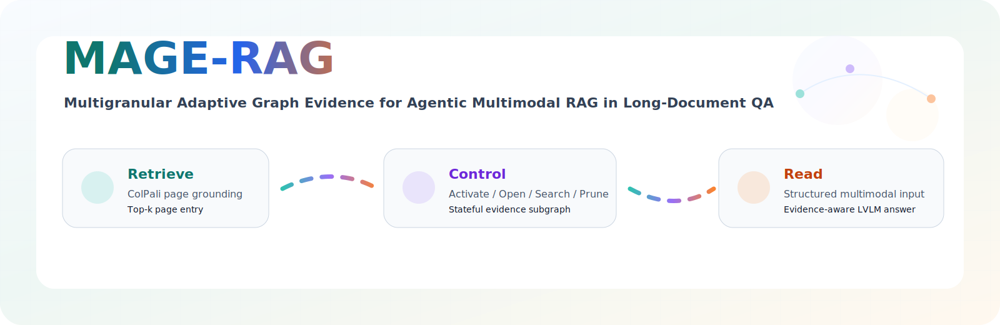
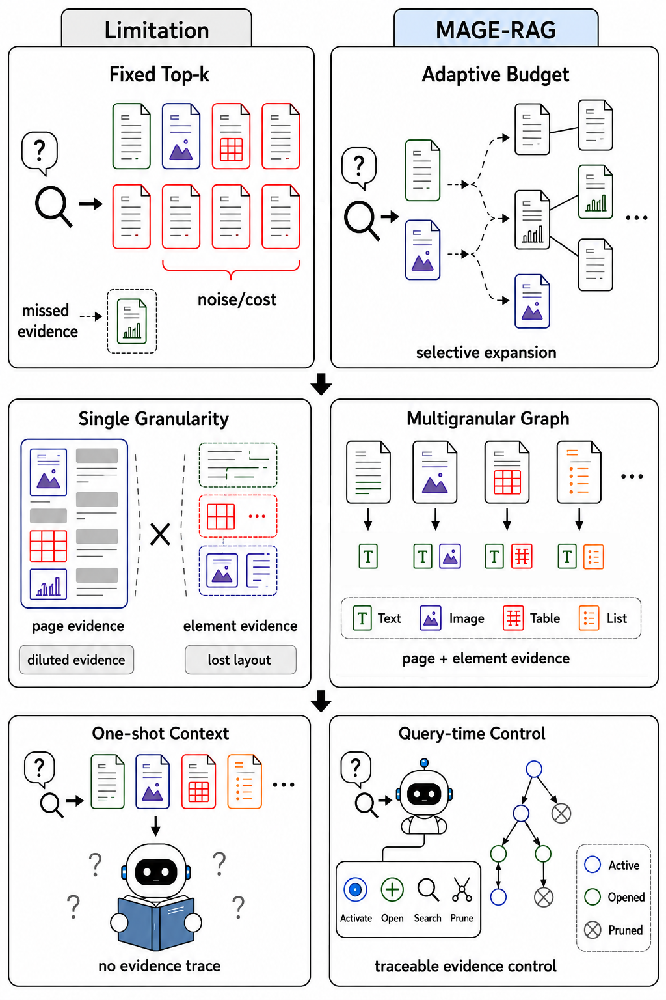
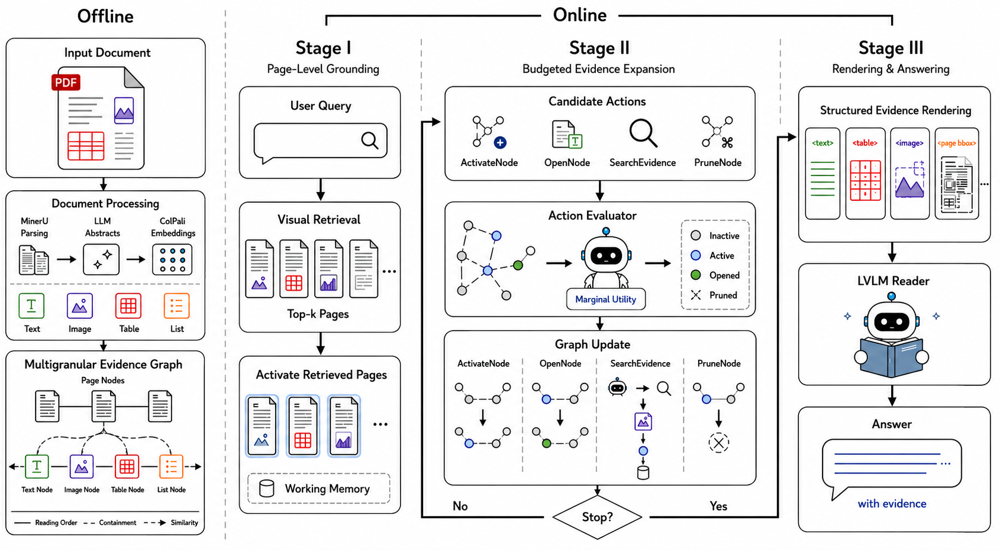

<div align="center">
  

<h1>MAGE-RAG</h1>

<p>
  <strong>Multigranular Adaptive Graph Evidence for Agentic Multimodal RAG in Long-Document QA</strong>
</p>

<p>
  <a href="#项目概览"></a>
  <a href="#方法概览"></a>
  <a href="LICENSE"></a>
</p>

<p>
  <a href="#主要实验结果"></a>
  <a href="#主要实验结果"></a>
</p>

<p>
  <a href="#项目概览">Overview</a> •
  <a href="#方法概览">Method</a> •
  <a href="#如何复现">Reproduction</a> •
  <a href="#数据准备">Data</a> •
  <a href="#引用">Citation</a>
</p>
</div>

---

## 项目概览

MAGE-RAG 是一个面向长 PDF 文档多模态问答的 Agentic Graph RAG 框架。

<div align="center">
  
</div>

在长 PDF 文档多模态问答场景当中，答案的证据往往是稀疏且异构的，具体表现为：

1. **稀疏性**：答案证据可能只分布在少数一个或几个页面与页内元素中，而大部分页面和元素可能与问题无关；
2. **异构性**：答案证据所来源的模态多种多样，包括但不限于整体的页面布局与局部的文本段落、表格、图像等多种模态信息；

现有的 RAG 方法通常采用返回固定 Top-k 的检索广度，同时普遍采用 page-level 或 chunk/element-level 的单种检索粒度。固定的 Top-k 检索在 k 值较小时，容易遗漏证据，而当 k 值较大时，又会引入不必要的噪声与成本；chunk/element-level 尽管返回的证据更为细节具体，但是缺乏对全局的把握，且检索的召回率与精确率更低，而 page-level 的检索虽然保留了全局信息，且在检索的召回率与精确率上表现较好，但会把大量无关噪声内容交给 Reader 模型，增大其理解负担。与此同时，当前的众多 RAG 方法大多提供 one-shot context，Reader 模型只能看到零散的证据，而无法得知证据之间的逻辑与扩展关系。

MAGE-RAG 通过有效的状态设计与自适应的证据控制、扩展机制，针对性地解决了上述 RAG 的固有缺陷。MAGE-RAG 离线建立文档级别的证据图，并在在线问答阶段，使用 page-level 检索找到高准确率的证据图入口，随后借助 Controller 选择性地激活证据图当中的部分细粒度节点，最后将被激活的节点包装为结构化的证据输入到 Reader 模型当中，有效地实现了自适应的证据广度、多粒度的证据粒度，以及可归因、可追溯的证据关系。

本仓库包含 MAGE-RAG 的核心实现、MMLongBench-Doc 与 LongDocURL 评测适配、多个 baseline 接入、证据图构建脚本、结果分析脚本，以及论文中主要表格和图的生成逻辑。

## 方法概览

<div align="center">
  
</div>

MAGE-RAG 的运行流程由四个部分组成：

1. **离线多粒度证据图构建**  
   文档解析后构建页面节点和页内元素节点。节点保存摘要、文本或结构化内容、bbox、页面图像或局部图像引用；边表示 containment、reading order、layout adjacency、section hierarchy 和 semantic neighbor 等关系。实现主要位于 `benchmarks/evidence_graph/`。

2. **页面级初始 grounding**  
   查询时先使用 ColPali 页面级视觉检索，在当前文档允许页范围内选出初始 Top-k 页面，并通过 `ActivatePage` 加入证据状态。实现主要位于 `baselines/magerag/retrieval.py`。

3. **在线证据控制器**  
   控制器维护 `Inactive / Active / Opened / Pruned` 状态，把当前证据、候选动作和最近 trace 编成 XML，由 evaluator 选择 `ActivateNode`、`OpenNode`、`SearchEvidence`、`PruneNode` 或停止扩展。实现主要位于 `baselines/magerag/state.py`、`baselines/magerag/evaluator.py` 和 `baselines/magerag/builder.py`。

4. **结构化多模态 reader 渲染**  
   最终状态中的非剪枝页面和元素被渲染为 page-organized XML，并与页面截图、局部节点图像或 bbox crop 一起输入 LVLM reader。实现主要位于 `baselines/magerag/renderer.py`。

> [!NOTE]
> MAGE-RAG 中的 `top_k` 是证据图搜索的入口页面预算，不等价于最终 reader 上下文大小。最终输入由后续图扩展、在线搜索、剪枝和渲染共同决定。

## 主要特点

| 特点 | 说明 |
| --- | --- |
| 多粒度证据图 | 同时建模 full-page 视觉上下文和页内段落、标题、表格、图片、图表等元素证据。 |
| Query-time evidence control | 根据问题、证据状态和历史 trace 动态扩展、打开、搜索和剪枝证据。 |
| 结构与语义联合扩展 | 支持 containment、reading order、layout、section hierarchy 和 semantic neighbor 等关系。 |
| 结构化多模态输入 | 将最终证据组织为 XML，并对齐页面图像、局部节点图像或 bbox crop。 |
| 统一评测协议 | 在 MMLongBench-Doc 和 LongDocURL 上比较 Direct MLLM、Text RAG、Page-level Visual RAG 和 Graph/Agentic RAG。 |
| 可审计 trace | 每次激活、打开、搜索、剪枝和停止决策都会记录，便于分析错误来源和证据路径。 |

## 仓库结构

```text
MAGE-RAG/
├── main.py                         # Hydra 入口：准备 embedding cache 后运行 benchmark
├── configs/                        # 默认配置、benchmark 配置、baseline 配置、LiteLLM 配置
├── baselines/
│   ├── magerag/                    # MAGE-RAG 状态机、控制器、检索、渲染和图存储
│   ├── bm25.py                     # BM25 文本检索 baseline
│   ├── colbertv2.py                # ColBERTv2 文本检索 baseline
│   ├── image.py                    # 页面级视觉输入 baseline
│   ├── m3docrag.py                 # M3DocRAG 接入
│   ├── evisrag.py                  # EVisRAG 接入
│   └── g2reader.py                 # G2Reader 接入
├── benchmarks/
│   ├── adapters.py                 # MMLongBench-Doc / LongDocURL 样本处理和评分
│   ├── runner.py                   # 统一运行、断点续跑、预测和 metrics 写出
│   ├── wrapper.py                  # benchmark 路由
│   ├── evidence_graph/             # 证据图节点、边、摘要、语义边和 embedding 构建
│   ├── mmlongbench/                # MMLongBench-Doc 数据说明、样例数据和脚本
│   ├── longdocurl/                 # LongDocURL 数据说明、预处理和脚本
│   └── utils/                      # 数据路径、embedding cache、PDF 处理和结果工具
├── analysis/                       # 论文结果表、breakdown、预算、trace、case study 分析
├── scripts/                        # 常用服务、构图、baseline 和 sweep 脚本
├── assets/readme/                  # README 展示图片
└── LICENSE
```

## 如何复现

### 环境

#### 本机实验环境

论文实验与仓库验证使用以下环境：

| 组件 | 版本或配置 |
| --- | --- |
| OS | Ubuntu 22.04.5 LTS, Linux 5.15, x86_64 |
| GPU | 2 × NVIDIA RTX PRO 6000 Blackwell, 96 GiB / GPU |
| NVIDIA Driver | 590.44.01 |
| CUDA | PyTorch CUDA runtime 12.8 |
| Python | 3.12.13 |
| PyTorch | 2.10.0+cu128 |
| TorchVision | 0.25.0 |
| Transformers | 5.5.4 |
| vLLM | 0.19.1 |
| PyMuPDF | 1.27.2.2 |
| MinerU | VLM 3.1.8 |
| ColPali | `vidore/colpali-v1.3-hf` |
| Reader / controller | `Qwen/Qwen3-VL-8B-Instruct` |

#### 创建 Python 环境并编辑环境变量

创建 Python 环境：

```bash
uv sync --frozen
```

复制 `.env` 模板文件：

```bash
cp .env.example .env
```

随后编辑 `.env` 文件。你可以在 [MinerU 官网](https://mineru.net/apiManage/token) 获取 MinerU API Key。

### 模型服务

MAGE-RAG 使用两个模型服务：

1. ColPali pooling 服务负责页面、问题和图节点向量化，默认地址为
   `http://127.0.0.1:8020`。
2. LVLM 服务负责节点摘要、证据控制和最终回答，默认配置为 `http://127.0.0.1:4000/v1`。

下载 [Qwen3-VL-8B-Instruct](https://huggingface.co/Qwen/Qwen3-VL-8B-Instruct)
和 [ColPali v1.3](https://huggingface.co/vidore/colpali-v1.3-hf)，然后分别启动服务：

```bash
# Terminal 1: Qwen3-VL reader/controller，改为监听 4000
env \
  MODEL_NAME=/path/to/Qwen3-VL-8B-Instruct \
  VLLM_BIN="$PWD/.venv/bin/vllm" \
  CUDA_VISIBLE_DEVICES=0 \
  PORT=4000 \
  bash scripts/serve_qwen3_vl_vllm.sh 128k

# Terminal 2: ColPali pooling，默认监听 8020
env \
  MODEL_NAME=/path/to/colpali-v1.3-hf \
  SERVED_MODEL_NAME=colpali-v1.3 \
  VLLM_BIN="$PWD/.venv/bin/vllm" \
  CUDA_VISIBLE_DEVICES=1 \
  bash scripts/serve_colpali_vllm.sh 8k
```

对于 Qwen3-VL-8B-Instruct 128k 上下文的部署，建议至少使用 48 GB 显存；对于 Colpali 8k 上下文的部署，建议至少使用 10 GB 显存。

如果发现部署失败，可以修改启动时的相关参数，包括但不限于：

- 如果显卡空闲，可以添加 `GPU_MEMORY_UTILIZATION=0.9` 参数
- 如果有多张显卡，可以修改 CUDA_VISIBLE_DEVICES 并添加 `TENSOR_PARALLEL_SIZE=2` 参数 (参数应与显卡数量匹配，且必须是2的倍数)
- 可以降低模型部署时的 `max_model_len`, `max-num-seqs`, `max-num-batched-tokens` 等参数
- 更多部署时的参数设置，可以参考 [vLLM 官方文档](https://docs.vllm.ai/en/stable/configuration/engine_args)

### 数据准备

原始 QA 文件和 PDF 使用 Git LFS 管理，因此克隆仓库后还需要额外拉取原始数据文件：

```bash
sudo apt-get update
sudo apt-get install -y git-lfs
cd MAGE-RAG
git lfs install
git lfs pull
```

下载完成后，当前仓库应包含以下原始数据：

```text
benchmarks/
├── mmlongbench/data/raw/
│   ├── samples.json                     # 1,091 个 QA 对，135 篇文档
│   └── documents/<doc_id>.pdf           # 原始 PDF
└── longdocurl/data/raw/
    ├── LongDocURL.jsonl                 # 2,325 个 QA 对，396 篇文档
    └── pdfs/4000-4999/<doc_no>.pdf      # 原始 PDF
```

#### 1. 将 PDF 渲染为页面 PNG

运行以下命令渲染 MMLongBench-Doc 的 PDF 文档：

```bash
uv run python benchmarks/scripts/preprocess_documents.py \
  --benchmark mmlongbench \
  --workers 8
```

MMLongBench-Doc 按 Benchmark 约定，默认渲染前 120 页，页面编号从 1 开始。

**预期输出：**

```text
benchmarks/mmlongbench/data/processed/pdf_pngs/
└── <doc_key>/
    └── page_<1-based page number, 4 digits>_dpi144.png
```

共包含 135 个文档；每个文档生成 `min(PDF 总页数, 120)` 张 144 DPI PNG。

---

运行以下命令渲染 LongDocURL 的 PDF 文档：

```bash
uv run python benchmarks/scripts/preprocess_documents.py \
  --benchmark longdocurl \
  --workers 8
```

LongDocURL 默认渲染完整 PDF，页面编号从 0 开始。

**预期输出：**

```text
benchmarks/longdocurl/data/processed/pdf_pngs/4000-4999/
└── <doc_no 前四位>/
    └── <doc_no>_<0-based page index>.png
```

共包含 396 个文档的全部页面，每个 PDF 页面对应一张 144 DPI PNG。

使用以下命令检查两个 Benchmark 的 PNG 是否完整且尺寸正确：

```bash
for benchmark in mmlongbench longdocurl; do
  uv run python benchmarks/scripts/verify_artifacts.py \
    --benchmark "$benchmark" \
    --stage png
done
```

检查通过后，末尾应输出：

```text
Verified mmlongbench png: 135 documents (5784 pages).
Verified longdocurl png: 396 documents (33913 pages).
```

#### 2. 使用 MinerU 解析 PDF

```bash
uv run --env-file .env python benchmarks/scripts/extract_mineru.py \
  --benchmark mmlongbench

uv run --env-file .env python benchmarks/scripts/extract_mineru.py \
  --benchmark longdocurl
```

**预期输出：**

```text
benchmarks/mmlongbench/data/processed/pdfs_mineru/<doc_key>/
├── layout.json
├── *_content_list_v2.json
└── images/                       # 文档包含提取图片时生成

benchmarks/longdocurl/data/processed/pdfs_mineru/4000-4999/<doc_no>/
├── layout.json
├── *_content_list_v2.json
└── images/                       # 文档包含提取图片时生成
```

`layout.json` 保存分页版面解析结果，`*_content_list_v2.json` 保存按页组织的文本、
标题、表格和图片等元素。MMLongBench-Doc 和 LongDocURL 应分别生成 135 和 396 个
文档目录；`images/` 仅在文档中提取到图片时存在。

使用以下命令检查两个 Benchmark 的 MinerU 结果：

```bash
for benchmark in mmlongbench longdocurl; do
  uv run python benchmarks/scripts/verify_artifacts.py \
    --benchmark "$benchmark" \
    --stage mineru
done
```

检查通过后，末尾应输出：

```text
Verified mmlongbench mineru: 135 documents.
Verified longdocurl mineru: 396 documents.
```

#### 3. 生成 ColPali 页面与问题向量

保持 8020 端口的 ColPali 服务运行，然后执行：

```bash
uv run python benchmarks/scripts/generate_colpali_embeddings.py \
  --benchmark mmlongbench

uv run python benchmarks/scripts/generate_colpali_embeddings.py \
  --benchmark longdocurl
```

**预期输出：**

```text
benchmarks/mmlongbench/data/cache/colpali/
├── pdf_embeddings/
│   ├── <doc_key>.safetensors
│   └── manifest.jsonl
└── question_embeddings/
    ├── <question_id>.safetensors
    └── manifest.jsonl

benchmarks/longdocurl/data/cache/colpali/
├── pdf_embeddings/4000-4999/
│   ├── <doc_no>.safetensors
│   └── manifest.jsonl
└── question_embeddings/
    ├── <question_id>.safetensors
    └── manifest.jsonl
```

每个 PDF 文件包含键 `embeddings`，形状为
`[页面数, page tokens, embedding dim]`；每个问题文件包含键
`query_embedding`，形状为 `[query tokens, embedding dim]`。`manifest.jsonl`
记录输入、输出路径、模型和处理状态。完整运行后，MMLongBench-Doc 应有 135 个
PDF 向量和 1,091 个问题向量，LongDocURL 应有 396 个 PDF 向量和 2,325 个问题
向量。

使用以下命令检查两个 Benchmark 的 PDF 和问题向量：

```bash
for benchmark in mmlongbench longdocurl; do
  uv run python benchmarks/scripts/verify_artifacts.py \
    --benchmark "$benchmark" \
    --stage colpali
done
```

检查通过后，末尾应输出：

```text
Verified mmlongbench colpali: 1226 artifacts (135 documents, 1091 questions).
Verified longdocurl colpali: 2721 artifacts (396 documents, 2325 questions).
```

#### 4. 构建证据图

构图过程依次生成 LLM abstract、元素级 ColPali embedding、结构边、布局边和
语义边。此步骤同时依赖 8020 端口的 ColPali 服务和 4000 端口的
OpenAI-compatible Qwen3-VL 服务：

```bash
uv run python benchmarks/scripts/build_evidence_graphs.py \
  --benchmark mmlongbench \
  --workers 16 \
  --abstract-processor-path /path/to/Qwen3-VL-8B-Instruct \
  --abstract-context-window 131072

uv run python benchmarks/scripts/build_evidence_graphs.py \
  --benchmark longdocurl \
  --workers 16 \
  --abstract-processor-path /path/to/Qwen3-VL-8B-Instruct \
  --abstract-context-window 131072
```

`--workers` 可根据模型服务吞吐调整。`--abstract-processor-path` 指向本地
Qwen3-VL processor，用于上下文预算检查。

**预期输出：**

```text
benchmarks/mmlongbench/data/processed/evidence_graphs/<doc_key>/
├── graph.json
├── nodes.jsonl
└── edges.jsonl

benchmarks/mmlongbench/data/cache/colpali/node_embeddings/<doc_key>/
└── *.safetensors

benchmarks/longdocurl/data/processed/evidence_graphs/4000-4999/<doc_no>/
├── graph.json
├── nodes.jsonl
└── edges.jsonl

benchmarks/longdocurl/data/cache/colpali/node_embeddings/4000-4999/<doc_no>/
└── *.safetensors
```

`graph.json` 保存文档、构图配置和节点/边数量等元数据；`nodes.jsonl` 保存页面
节点与页内元素节点；`edges.jsonl` 保存结构、布局和语义关系。每个非页面节点
对应一个包含 `embedding` 键的 `.safetensors` 文件，页面节点复用第 3 步生成的
PDF 页面向量。完整构建后，MMLongBench-Doc 和 LongDocURL 应分别生成 135 和
396 个证据图目录。

使用以下命令检查两个 Benchmark 的证据图和节点向量：

```bash
for benchmark in mmlongbench longdocurl; do
  uv run python benchmarks/scripts/verify_artifacts.py \
    --benchmark "$benchmark" \
    --stage graph
done
```

检查通过后，末尾应输出：

```text
Verified mmlongbench graph: 135 graphs.
Verified longdocurl graph: 396 graphs.
```

### 在线问答与评测

先用单个样本检查完整链路：

```bash
uv run python main.py \
  benchmarks=mmlongbench \
  benchmarks.limit=1 \
  benchmarks.process_mode=serial
```

确认服务和缓存均正常后，运行两个 benchmark：

```bash
uv run python main.py --multirun \
  benchmarks=mmlongbench,longdocurl
```

程序支持断点续跑。逐样本预测写入
`results/<benchmark>/magerag/*.jsonl`，汇总指标写入同名
`*.metrics.json`；Hydra 运行配置和日志保存在 `outputs/`。如需重新生成已有结果，
在命令末尾添加 `overwrite=true`。

## 引用

如果本仓库对你的研究有帮助，请引用 MAGE-RAG。

```bibtex
@article{zuo2026mage,
  title={MAGE-RAG: Multigranular Adaptive Graph Evidence for Agentic Multimodal RAG in Long-Document QA},
  author={Zuo, Yilong and Li, Xunkai and Yuan, Jing and Dai, Qiangqiang and Qin, Hongchao and Li, Ronghua},
  journal={arXiv preprint arXiv:2606.15906},
  year={2026}
}
```

## License

本项目代码采用 [MIT License](LICENSE)。

## Acknowledgements

该项目依赖于以下项目，感谢！

- MinerU：提供 PDF 文档解析服务 (https://github.com/opendatalab/MinerU.git)
- Colpali：用于页面级视觉检索 (https://huggingface.co/vidore/colpali-v1.3-hf)
