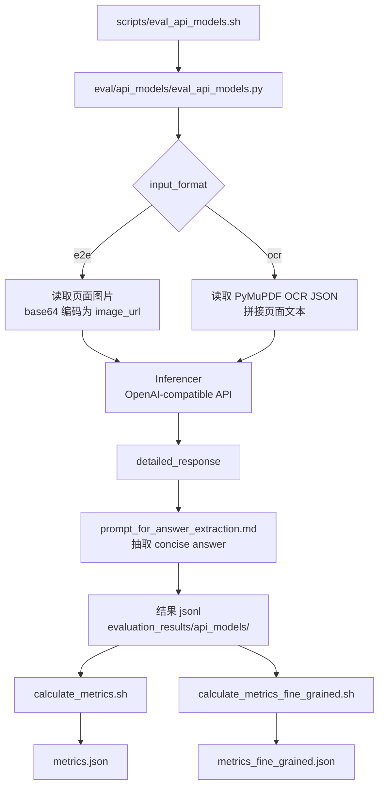
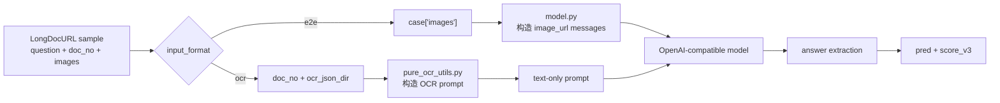
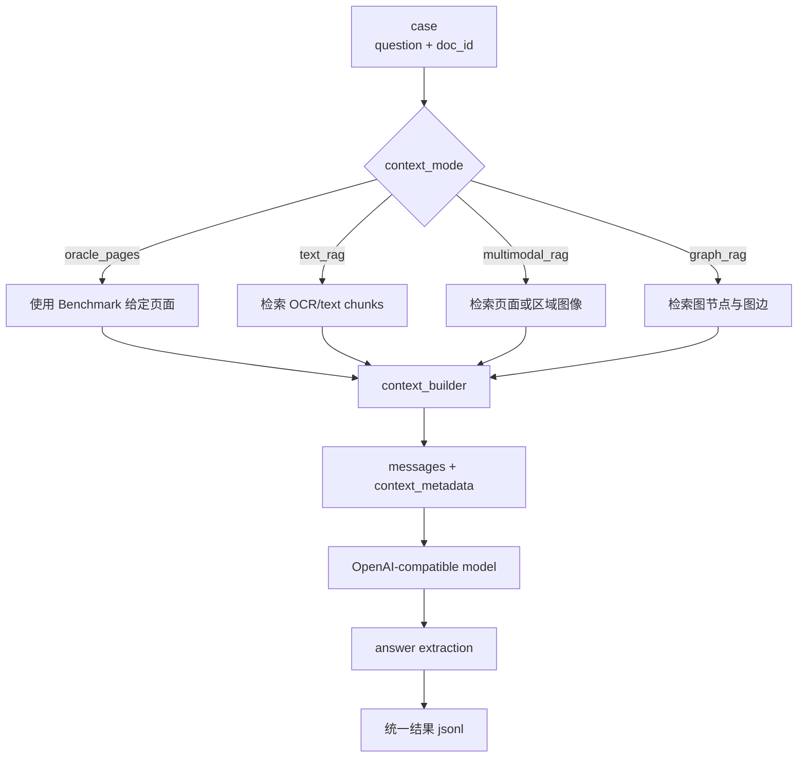
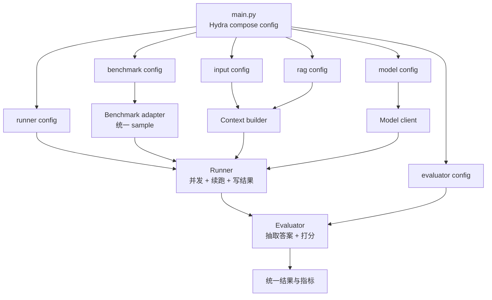

# LongDocURL Benchmark 代码流程与使用说明

本文档只记录我们后续真正需要留意和修改的部分。当前实验统一走 API/OpenAI-compatible 路径：

```text
scripts/eval_api_models.sh
  -> eval/api_models/eval_api_models.py
    -> eval/api_models/model.py
    -> eval/api_models/pure_ocr_utils.py
    -> eval/prompt_for_answer_extraction.md
    -> utils/utils_score_v3.py
  -> evaluation_results/api_models/*.jsonl

scripts/calculate_metrics.sh
scripts/calculate_metrics_fine_grained.sh
  -> utils/calculate_metrics.py
  -> utils/calculate_metrics_fine_grained.py
  -> evaluation_results/api_models/<result_stem>/metrics*.json
```



## 1. 最小运行流程

### 1.1 运行模型评测

入口脚本：

```bash
bash scripts/eval_api_models.sh
```

当前脚本直接调用：

```bash
python eval/api_models/eval_api_models.py \
    --qa_file data/LongDocURL.jsonl \
    --process_mode parallel \
    --llm_provider local \
    --input_format e2e \
    --ocr_backend pymupdf \
    --ocr_json_dir /root/autodl-tmp/ylz/NeurIPS_2026/code/benchmarks/longdocurl/data/pdf_jsons/4000-4999 \
    --image_prefix /root/autodl-tmp/ylz/NeurIPS_2026/code/benchmarks/longdocurl/data/pdf_pngs/4000-4999 \
    --model_name Qwen/Qwen2.5-VL-7B-Instruct
```

实际最需要改的通常只有两个参数：

- `--input_format`: 选择 `e2e` 或 `ocr`。
- `--model_name`: 必须和本地 OpenAI-compatible 服务暴露的模型名一致。

`--process_mode` 一般保持 `parallel`。除非需要调试单条样本，才改成 `serial`。

### 1.2 等待结果输出

结果默认输出到：

```text
evaluation_results/api_models/
```

典型文件名：

```text
evaluation_results/api_models/results_Qwen_Qwen2.5_VL_7B_Instruct_e2e.jsonl
evaluation_results/api_models/results_Qwen_Qwen2.5_VL_7B_Instruct_ocr.jsonl
```

评测支持断点续跑：如果结果文件已存在，代码会按 `question_id` 跳过已经完成的样本。

每条结果主要包含：

```text
detailed_response
pred
score_v3
input_format
ocr_backend
ocr_pages_used
```

其中后续指标计算真正依赖的是：

```text
pred
answer
answer_format
```

### 1.3 计算整体指标

先修改：

```text
scripts/calculate_metrics.sh
```

把 `--results_file` 改成上一步生成的 jsonl，例如：

```bash
python utils/calculate_metrics.py \
    --results_file evaluation_results/api_models/results_Qwen_Qwen2.5_VL_7B_Instruct_ocr.jsonl
```

然后运行：

```bash
bash scripts/calculate_metrics.sh
```

输出：

```text
evaluation_results/api_models/<result_stem>/metrics.json
```

核心字段：

```text
avg_acc
rectified_avg_acc
```

`rectified_avg_acc` 会把未完成样本按 0 分计入 2325 条总样本，因此如果只跑了子集，应主要看 `avg_acc`。

### 1.4 计算细粒度指标

先修改：

```text
scripts/calculate_metrics_fine_grained.sh
```

把 `--results_file` 改成同一个结果 jsonl，例如：

```bash
python utils/calculate_metrics_fine_grained.py \
    --results_file evaluation_results/api_models/results_Qwen_Qwen2.5_VL_7B_Instruct_ocr.jsonl
```

然后运行：

```bash
bash scripts/calculate_metrics_fine_grained.sh
```

输出：

```text
evaluation_results/api_models/<result_stem>/metrics_fine_grained.json
```

细粒度维度包括：

- `Main_Task`: Understanding, Reasoning, Locating
- `Element_Type`: Text, Layout, Figure, Table
- `Evidence_Pages`: Single_Page, Multi_Page
- `Fine_Grained`: 按任务、页数、元素类型进一步细分

## 2. 当前真正需要留意的参数

### 2.1 `input_format`

位置：

```text
scripts/eval_api_models.sh
eval/api_models/eval_api_models.py
```

可选值：

```text
e2e
ocr
```

`input_format=e2e` 表示把页面图片传给模型。代码会读取 `case["images"]`，将图片编码为 base64，并放入 OpenAI-compatible message 的 `image_url` 字段。

`input_format=ocr` 表示不传图片，只传 PyMuPDF 提取出的文本。当前 OCR backend 固定使用：

```text
ocr_backend=pymupdf
```

我们后续比较“直接看图”和“只看 OCR 文本”时，主要就是切换这个参数。



### 2.2 `process_mode`

位置：

```text
scripts/eval_api_models.sh
eval/api_models/eval_api_models.py
```

可选值：

```text
parallel
serial
```

一般保持：

```text
process_mode=parallel
```

只有在定位 bug、看单条样本 prompt 或检查模型输出时，才切到 `serial`。

需要注意：`parallel` 模式的进程数目前在代码中写死为：

```python
Pool(processes=64)
```

如果本地模型服务扛不住并发，才需要临时改小。

### 2.3 `model_name`

位置：

```text
scripts/eval_api_models.sh
eval/api_models/model.py
```

`model_name` 会原样传给：

```python
client.chat.completions.create(model=model_name, ...)
```

因此它必须和本地模型服务暴露的名称一致。新增模型时，通常只改脚本里的：

```bash
--model_name <your_model_name>
```

当前 `eval/api_models/model.py` 已经使用通用 `Inferencer`，不需要为每个模型新增一个 inferencer class。

### 2.4 模型服务配置

配置文件：

```text
config/api_config.json
```

当前脚本使用：

```bash
--llm_provider local
```

因此主要看：

```json
"local_model": {
  "access_key": "",
  "base_url": "http://localhost:4000/v1"
}
```

只要本地服务兼容 OpenAI `/v1/chat/completions`，就可以通过这条路径评测。

### 2.5 指标脚本的输入文件

两个指标脚本都不会自动找到最新结果，需要手动改 `--results_file`：

```text
scripts/calculate_metrics.sh
scripts/calculate_metrics_fine_grained.sh
```

这是最容易忘记的地方。每次跑完新模型或新 `input_format` 后，都要确认指标脚本读的是对应 jsonl。

## 3. API 评测代码流程

核心入口：

```text
eval/api_models/eval_api_models.py
```

### 3.1 初始化与续跑

程序会：

- 读取 `config/api_config.json`。
- 创建 OpenAI-compatible client。
- 读取 `data/LongDocURL.jsonl`。
- 如果结果文件已存在，按 `question_id` 跳过已完成样本。
- 调用 `evaluate(...)` 开始推理。

### 3.2 单样本推理

核心函数：

```python
eval_per_record(args)
```

`e2e` 模式：

```text
question + images -> vision prompt -> Inferencer -> model response
```

`ocr` 模式：

```text
question + PyMuPDF OCR text -> text prompt -> Inferencer -> model response
```

OCR 文本由下面的函数构造：

```text
eval/api_models/pure_ocr_utils.py
  -> get_pure_ocr_prompt_pymupdf(...)
```

该函数会根据 `doc_no` 找到对应 OCR JSON，并按样本涉及的页面组织文本。

### 3.3 短答案抽取

模型原始回答会先写入：

```text
detailed_response
```

然后程序读取：

```text
eval/prompt_for_answer_extraction.md
```

再次调用模型，从原始回答中抽取：

```text
<concise_answer>...</concise_answer>
<answer_format>...</answer_format>
```

抽取结果写入：

```text
pred
```

如果抽取失败：

```text
pred = "Fail to extract"
score_v3 = 0.0
```

后续如果发现某个模型经常答对但抽取失败，应该优先检查 `eval/prompt_for_answer_extraction.md` 和 `call_llm(...)` 的抽取逻辑，而不是只看主模型输出。

### 3.4 打分与结果写入

单条样本的即时分数由：

```text
utils/utils_score_v3.py
```

计算。评测过程中会把样本追加写入 jsonl。指标脚本之后会重新读取 jsonl 并重新计算分数，所以只要 `pred`、`answer`、`answer_format` 保持正确，新增额外字段不会影响指标。

## 4. 后续接入 RAG 时关注哪里

当前代码不做检索。它直接使用数据集中给定的页面图片或对应 OCR 文本回答问题。后续接入 RAG，本质上是替换或增强 `eval_per_record` 里构造上下文的部分。

推荐接入点：

```text
eval/api_models/eval_api_models.py -> eval_per_record
```

当前逻辑可以概括为：

```text
case -> selected images / selected OCR pages -> prompt -> model -> answer
```

RAG 后可以改成：

```text
case -> retriever -> retrieved context -> prompt -> model -> answer
```

或：

```text
case -> selected pages + retrieved context -> prompt -> model -> answer
```



### 4.1 建议新增 `context_mode`

建议后续新增一个参数：

```text
--context_mode oracle_pages | text_rag | multimodal_rag | graph_rag
```

含义：

- `oracle_pages`: 当前默认方式，使用数据集给定页面。
- `text_rag`: 从 OCR 文本 chunk 中检索 top-k，再回答。
- `multimodal_rag`: 检索页面图片、图表区域、版面区域或多模态 embedding chunk。
- `graph_rag`: 检索文档图节点、边和相关 evidence package。

这样不同 baseline 可以共享同一套模型调用、答案抽取和指标计算逻辑。

### 4.2 建议抽出 context builder

不要把所有 RAG 逻辑都写进 `eval_per_record`。建议新增：

```text
eval/context_builders/
  __init__.py
  oracle_pages.py
  text_rag.py
  multimodal_rag.py
  graph_rag.py
```

统一接口可以设计成：

```python
def build_context(case, args) -> dict:
    return {
        "prompt_context": "...",
        "images": [...],
        "metadata": {...},
    }
```

`eval_per_record` 只负责：

```text
读取样本
调用 context builder
拼 prompt
调用模型
抽取答案
写结果
```

### 4.3 文本 RAG

文本 RAG 最接近当前 `input_format=ocr`，建议优先实现。

基本流程：

- 离线从 PyMuPDF OCR JSON 构建 chunk。
- 为 chunk 建立向量索引。
- 推理时用 `question` 检索 top-k chunk。
- 将 chunk text、page_no、可选 bbox 或 layout 信息放入 prompt。
- 在结果 jsonl 中记录 `retrieved_context`、`retrieved_pages`、`retriever_scores`。

### 4.4 多模态 RAG

多模态 RAG 可以以 page-level 为第一版，先检索页面图片，再把 top-k 页面作为 `images` 传给模型。

后续再考虑更细粒度：

- region-level 图表或表格检索。
- OCR text embedding 与 image embedding 融合排序。
- 检索结果同时包含图片和文本说明。

需要特别留意图片数量。当前 e2e 路径会把所有 `images` 都编码进请求，top-k 过大时会影响吞吐和上下文限制。

### 4.5 多模态图 RAG

多模态图 RAG 可以把文档组织成：

```text
node: page, text block, table, figure, title, section, entity
edge: same_page, reading_order, caption_of, refers_to, section_contains, semantic_similar
```

推理时：

- 用 query 检索初始节点。
- 在图上做邻居扩展或路径搜索。
- 把最终节点转为 evidence package。
- Prompt 中保留 node type、page_no、text、bbox、caption、relation 等信息。

建议结果中额外记录：

```text
rag_mode
retrieved_nodes
retrieved_edges
retrieved_pages
retrieval_trace
```

这些字段不会影响现有指标脚本。

## 5. 后续统一 LongDocURL 与 MMLongBench 的建议

后续如果要把 LongDocURL、MMLongBench，以及文本 RAG、多模态 RAG、多模态图 RAG 等 baseline 放到同一个实验框架里，建议不要继续为每个 benchmark 维护一套独立脚本。更好的方向是用 Hydra 管理配置，用统一的 `main.py` 作为实验入口。

目标入口可以长这样：

```bash
python main.py benchmark=longdocurl input=e2e model=qwen25_vl rag=none
python main.py benchmark=longdocurl input=ocr model=qwen25_vl rag=text_rag
python main.py benchmark=mmlongbench input=image model=qwen25_vl rag=multimodal_rag
python main.py benchmark=mmlongbench input=text model=qwen25_vl rag=graph_rag ablation.no_graph_edges=true
```



### 5.1 推荐的工程边界

统一框架里建议把代码拆成几类稳定接口：

```text
main.py
configs/
src/
  benchmarks/
  models/
  context_builders/
  rag/
  runners/
  evaluators/
  io/
```

各模块职责建议如下：

- `benchmarks/`: 负责把不同 benchmark 的原始样本统一成内部 sample 格式。
- `models/`: 负责 OpenAI-compatible 调用、本地 server 调用、重试、路由和限流。
- `context_builders/`: 负责根据 `input` 和 `rag` 配置构造模型输入上下文。
- `rag/`: 负责索引、检索、图扩展、重排等 RAG 逻辑。
- `runners/`: 负责断点续跑、并发、结果写入和失败重试。
- `evaluators/`: 负责答案抽取、指标计算和 benchmark-specific 评分。
- `io/`: 负责 json/jsonl 读写、路径组织、缓存目录和日志。

核心原则是：benchmark 只定义“数据长什么样、怎么算分”，RAG 只定义“怎么找上下文”，runner 只定义“怎么批量跑实验”。不要把这三件事混在同一个函数里。

### 5.2 推荐的 Hydra 配置结构

建议先按下面的粒度拆配置：

```text
configs/
  config.yaml
  benchmark/
    longdocurl.yaml
    mmlongbench.yaml
  input/
    e2e.yaml
    ocr.yaml
    image.yaml
    text.yaml
  model/
    qwen25_vl.yaml
    gpt4o.yaml
    router.yaml
  rag/
    none.yaml
    text_rag.yaml
    multimodal_rag.yaml
    graph_rag.yaml
  runner/
    default.yaml
    debug.yaml
  evaluator/
    longdocurl.yaml
    mmlongbench.yaml
  ablation/
    default.yaml
```

`config.yaml` 只做组合，不写具体实验细节：

```yaml
defaults:
  - benchmark: longdocurl
  - input: e2e
  - model: qwen25_vl
  - rag: none
  - runner: default
  - evaluator: longdocurl
  - ablation: default
  - _self_
```

后续跑实验时用 Hydra override 组合不同设置，而不是复制多个 shell 脚本。

### 5.3 统一 sample 与 result 格式

两个 benchmark 的原始字段不同，但进入 runner 之后应该统一成内部格式。例如：

```python
UnifiedSample = {
    "sample_id": "...",
    "benchmark": "longdocurl",
    "doc_id": "...",
    "question": "...",
    "answer": "...",
    "answer_format": "...",
    "metadata": {...},
}
```

输出结果也建议统一保留这些字段：

```text
sample_id
benchmark
model_name
input_mode
rag_mode
detailed_response
pred
answer
answer_format
score
retrieval_metadata
status
error
```

这样 LongDocURL 和 MMLongBench 可以共用 runner、结果聚合、错误分析和日志系统。不同 benchmark 的差异只留在 adapter 和 evaluator 里。

### 5.4 `context_builder` 是整合 RAG 的关键

统一框架中最关键的抽象应该是 `context_builder`。它接收统一 sample 和配置，输出模型可直接消费的输入。

推荐接口：

```python
def build_context(sample, cfg) -> dict:
    return {
        "messages": [...],
        "context_metadata": {...},
    }
```

不同模式对应不同 builder：

- `oracle_pages`: 使用 benchmark 给定的页面或上下文，等价于当前 LongDocURL 默认方式。
- `ocr`: 使用 OCR 文本，不做检索。
- `text_rag`: 从 OCR/text chunk 中检索 top-k。
- `multimodal_rag`: 检索页面图像或区域图像。
- `graph_rag`: 检索图节点、图边和 evidence package。

这样模型调用代码不需要知道上下文来自 oracle、OCR、文本检索、图像检索还是图检索。

### 5.5 不建议一开始就过度抽象

建议分阶段迁移：

1. 先把 LongDocURL 的 `eval_api_models.py` 和 MMLongBench 的 `run_api.py`/`run_api_text.py` 包一层 adapter，保留原有可运行逻辑。
2. 再抽出统一的 OpenAI-compatible model client、答案抽取、断点续跑和结果写入。
3. 然后引入 `context_builder`，让 `input=e2e/ocr/image/text` 变成配置选择。
4. 最后接入 `rag=text_rag/multimodal_rag/graph_rag` 和 ablation 配置。

这样可以避免一次性重构太多，导致原本能跑的 benchmark 被破坏。

### 5.6 需要固定下来的配置维度

后续建议明确这些维度，避免实验命名和脚本越来越乱：

- `benchmark`: `longdocurl` 或 `mmlongbench`。
- `input`: `e2e`、`ocr`、`image`、`text` 等输入流。
- `rag`: `none`、`text_rag`、`multimodal_rag`、`graph_rag`。
- `model`: 主回答模型及 API 服务配置。
- `extractor`: 答案抽取模型，可以默认复用主模型，也可以独立配置。
- `runner`: 并发数、断点续跑、失败重试、limit/debug。
- `ablation`: 图边开关、检索 top-k、是否使用图结构、是否使用 layout/bbox、是否使用图像证据等。
- `evaluator`: benchmark-specific 的答案抽取后处理和打分逻辑。

这套结构的核心价值是：新增 baseline 时只新增配置和局部模块，不新增一条完整脚本链路。

## 6. 当前值得改进但不影响跑通的点

这些点不需要马上改，但如果后续要系统性接入多个 RAG baseline，值得整理：

- `parallel` 的进程数写死为 64，建议改成 `--num_workers`。
- 指标脚本需要手动改 `--results_file`，容易读错结果。
- 答案抽取阶段复用同一个 `model_name`，后续可以单独设置 extractor model。
- 结果写入是多进程 append 同一个 jsonl，高并发或网络文件系统上有潜在风险。
- RAG 相关字段应只作为额外字段写入 jsonl，不要破坏 `pred`、`answer`、`answer_format` 这三个指标依赖字段。
