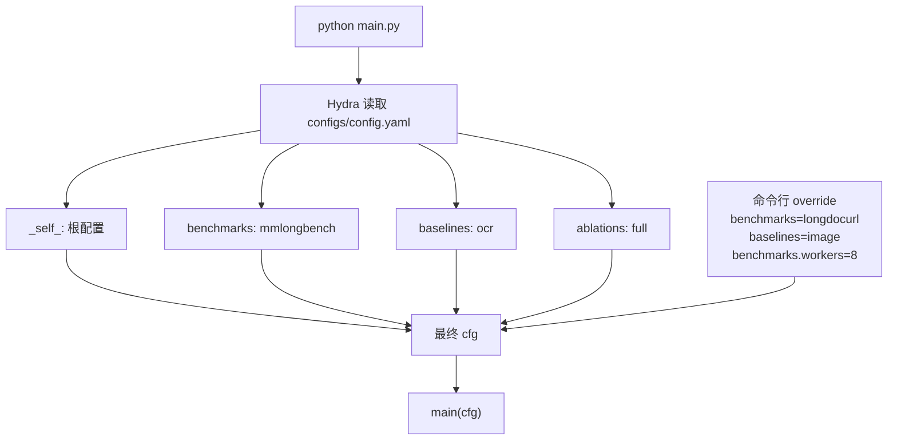
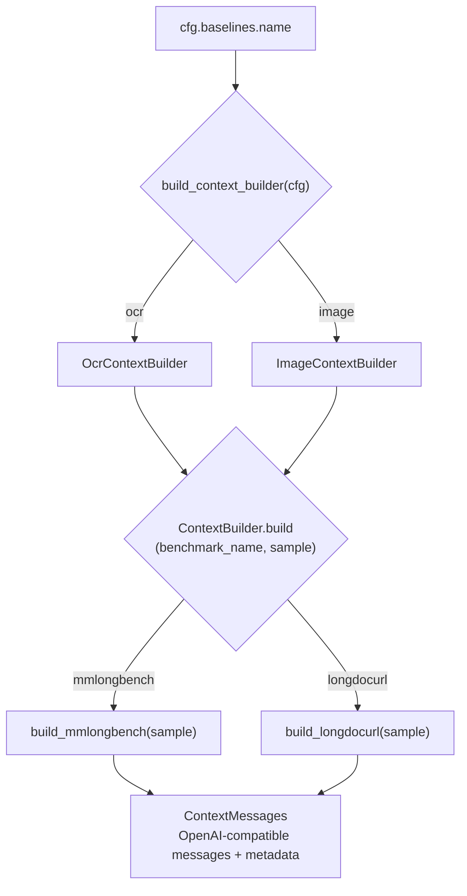
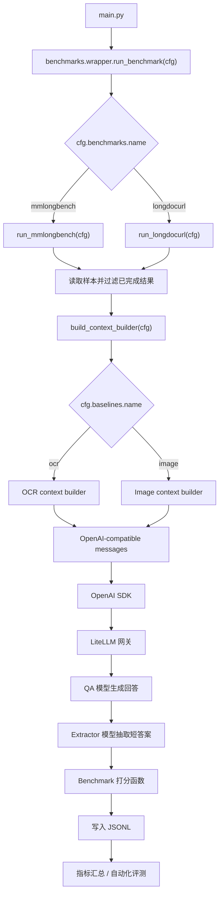
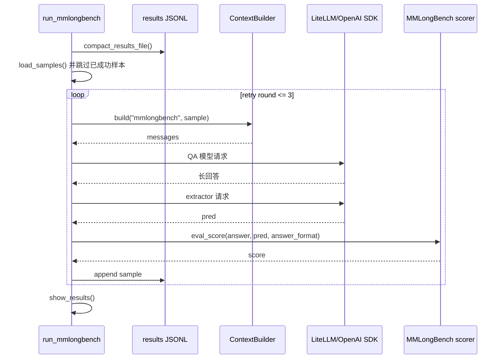
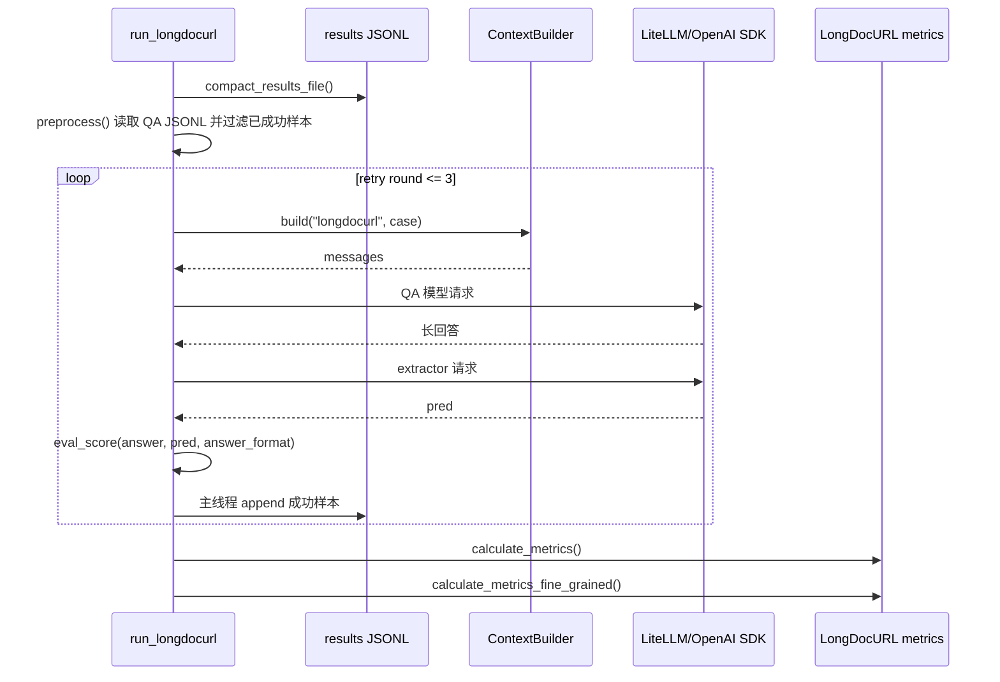
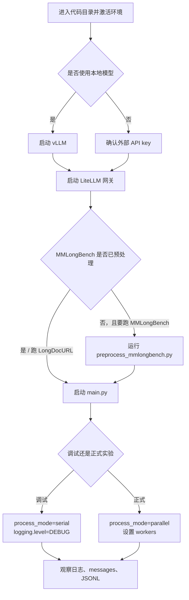
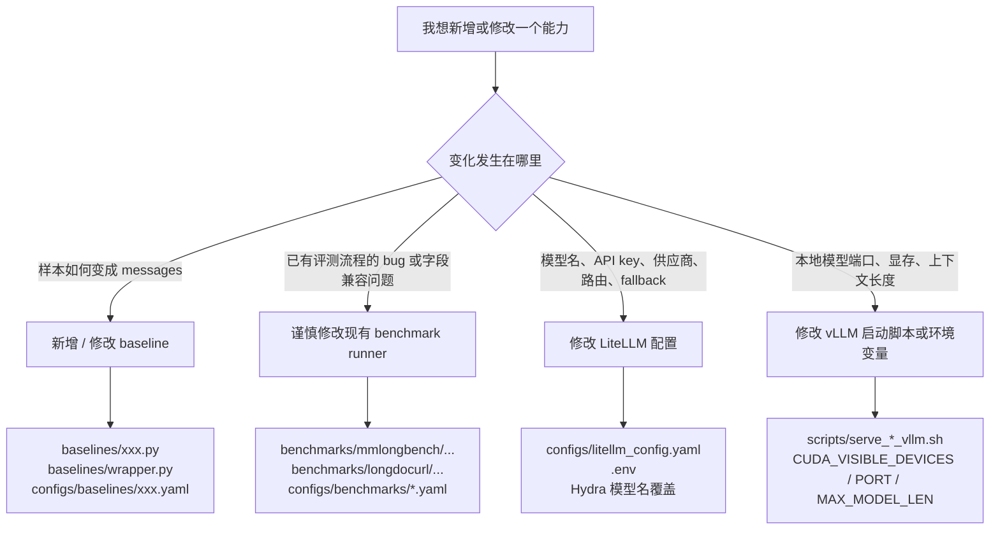

# 最新代码使用说明以及相关注意事项

## 代码逻辑拆解

### Hydra 读取配置

本项目的主入口是 [`main.py`](../main.py)。文件最上方的装饰器：

```python
@hydra.main(version_base="1.3", config_path="configs", config_name="config")
```

含义是：程序启动时，Hydra 会读取 [`configs/config.yaml`](../configs/config.yaml)，并把配置解析成一个 `DictConfig` 对象传入 `main(cfg)`。因此后续代码里看到的 `cfg`，本质上就是一棵可以用点号访问的配置树，例如：

```python
cfg.benchmarks.name
cfg.baselines.name
cfg.litellm.base_url
cfg.logging.level
```

`configs/config.yaml` 里最重要的是 `defaults`：

```yaml
defaults:
  - _self_
  - benchmarks: mmlongbench
  - baselines: ocr
  - ablations: full
```

配置合并关系可以先看这张图：



这表示默认情况下 Hydra 会把以下配置合并起来：

1. `configs/config.yaml` 自身；
2. [`configs/benchmarks/mmlongbench.yaml`](../configs/benchmarks/mmlongbench.yaml)；
3. [`configs/baselines/ocr.yaml`](../configs/baselines/ocr.yaml)；
4. [`configs/ablations/full.yaml`](../configs/ablations/full.yaml)。

合并之后，`cfg.benchmarks` 就来自 `configs/benchmarks/mmlongbench.yaml`，`cfg.baselines` 就来自 `configs/baselines/ocr.yaml`。所以默认运行：

```bash
python main.py
```

等价于运行 `MMLongBench + OCR baseline`。如果想改成 `LongDocURL + image baseline`，不需要改 Python 代码，只需要在命令行覆盖 Hydra 配置：

```bash
python main.py benchmarks=longdocurl baselines=image
```

也可以覆盖更细的字段，例如：

```bash
python main.py benchmarks=mmlongbench baselines=ocr benchmarks.workers=8 benchmarks.process_mode=parallel
```

需要注意：Hydra 默认会创建每次运行的输出目录。本项目配置在 `configs/config.yaml` 的 `hydra.run.dir` 中：

```yaml
hydra:
  run:
    dir: ${paths.output_root}/${now:%Y-%m-%d}/${now:%H-%M-%S}
```

因此每次运行都会产生类似 `outputs/2026-04-30/12-34-56` 的 Hydra 运行目录。项目又设置了：

```yaml
hydra:
  job:
    chdir: false
```

这表示 Hydra 不会把当前工作目录切换到输出目录，代码里的相对路径仍然以启动程序时所在目录为准。这个设置很重要，否则很多初学者会遇到“明明文件存在，但程序找不到”的问题。

`main.py` 的逻辑很短：

```python
load_dotenv(dotenv_path=Path(__file__).resolve().parent / ".env")
apply_logging_config(cfg)
logger.info(OmegaConf.to_yaml(cfg, resolve=True))
run_benchmark(cfg)
```

也就是说：

1. 先加载仓库根目录下的 `.env`；
2. 根据 `cfg.logging` 设置日志等级；
3. 打印最终合并后的完整配置；
4. 把 `cfg` 交给 benchmark 分发器。

这里的关键工程思想是：**配置决定运行对象，代码只负责根据配置分发**。新增实验时优先考虑新增或覆盖 YAML，而不是在 Python 里到处写 if/else。

### Baselines 面向对象设计

本项目里的 baseline 不是“模型类”，而是“上下文构造器”。它的职责是：给定一个 benchmark 样本，把它转换成 OpenAI / LiteLLM 可接受的 `messages`。

核心抽象在 [`baselines/base.py`](../baselines/base.py)：

```python
class ContextBuilder:
    name = None

    def __init__(self, cfg=None):
        self.cfg = cfg

    def build(self, benchmark_name, sample, **kwargs):
        if benchmark_name == 'mmlongbench':
            return self.build_mmlongbench(sample, **kwargs)
        if benchmark_name == 'longdocurl':
            return self.build_longdocurl(sample, **kwargs)
        raise ValueError(...)
```

`ContextBuilder.build()` 是统一入口。它根据 benchmark 名称继续分发到：

1. `build_mmlongbench()`；
2. `build_longdocurl()`。

这说明同一个 baseline 需要知道如何适配不同 benchmark 的样本格式。例如 `ocr` baseline 在 MMLongBench 中读取的是预处理后的逐页 OCR JSON；在 LongDocURL 中读取的是 LongDocURL 自己的 PyMuPDF OCR JSON。

`ContextMessages` 继承自 `list`：

```python
class ContextMessages(list):
    def __init__(self, messages, metadata=None):
        super().__init__(messages)
        self.metadata = metadata or {}
```

它本质上仍然是一个普通的 `messages` 列表，可以直接传给 OpenAI SDK；额外的 `metadata` 用来记录上下文构造方式，例如 `context_builder=image`。这个设计避免了后续 API 调用还要拆一层对象。

baseline 的注册表在 [`baselines/wrapper.py`](../baselines/wrapper.py)：

```python
_CONTEXT_BUILDERS = {
    'image': ImageContextBuilder,
    'ocr': OcrContextBuilder,
}
```

`build_context_builder(cfg)` 会读取：

```python
name = cfg.baselines.name
```

然后返回对应的 builder 实例。

baseline 的选择和调用关系如下：



因此 `configs/baselines/ocr.yaml` 中的：

```yaml
name: ocr
```

会创建 `OcrContextBuilder(cfg)`；

`configs/baselines/image.yaml` 中的：

```yaml
name: image
```

会创建 `ImageContextBuilder(cfg)`。

#### OCR Baseline

OCR baseline 在 [`baselines/ocr.py`](../baselines/ocr.py) 中实现。它把 PDF 页面文本拼接进 prompt。

对 MMLongBench：

1. 从 `sample['question']` 读取问题；
2. 根据 `sample['doc_id']` 和 `cfg.benchmarks.max_pages` 找到预处理缓存；
3. 逐页读取 `page_0001.json`, `page_0002.json` 等；
4. 拼成如下结构：

```text
[Page 1]
第一页文本

[Page 2]
第二页文本
```

如果第一页缓存都不存在，会直接抛出 `FileNotFoundError`，提示先运行：

```bash
python benchmarks/mmlongbench/scripts/preprocess_mmlongbench.py
```

对 LongDocURL：

1. 读取 `sample['question']`；
2. 调用 `get_pure_ocr_prompt_pymupdf()`；
3. 根据 `sample['images']` 或 `sample['start_end_idx']` 选择页面；
4. 从 `cfg.benchmarks.ocr_json_dir` 读取 OCR JSON；
5. 生成纯文本 prompt。

#### Image Baseline

Image baseline 在 [`baselines/image.py`](../baselines/image.py) 中实现。它把页面图片编码成 base64，塞进 OpenAI vision messages。

对 MMLongBench：

1. 根据 `sample['doc_id']` 找到预处理后的 PNG 页面；
2. 读取最多 `cfg.benchmarks.max_pages` 页；
3. 用 PIL 打开图片并编码成 JPEG base64；
4. 构造如下 messages：

```python
[
    {
        "role": "user",
        "content": [
            {"type": "text", "text": question},
            {"type": "image_url", "image_url": {"url": "data:image/jpeg;base64,..."}},
            ...
        ],
    }
]
```

对 LongDocURL：

1. 从 `sample['images']` 读取图片路径；
2. 每张图片编码成 base64；
3. 构造 `text + image_url + text + image_url ...` 的多模态输入。

这里要特别注意一个边界：**OCR baseline 和 image baseline 都依赖预处理数据**。MMLongBench 的预处理逻辑在 [`benchmarks/mmlongbench/scripts/preprocess_mmlongbench.py`](../benchmarks/mmlongbench/scripts/preprocess_mmlongbench.py)，会把 PDF 同时导出为 OCR JSON 和 PNG 页面；LongDocURL 则默认读取已有的 `ocr_json_dir` 和 `image_prefix`。

### 调用流程

整体调用链可以理解为：



#### Benchmark 分发

[`benchmarks/wrapper.py`](../benchmarks/wrapper.py) 是 benchmark 层的分发器：

```python
def run_benchmark(cfg):
    benchmark_cfg = cfg.get('benchmarks', {})
    benchmark_name = benchmark_cfg.get('name', None)
    if benchmark_name == 'mmlongbench':
        return _run_mmlongbench(cfg)
    if benchmark_name == 'longdocurl':
        return _run_longdocurl(cfg)
    raise ValueError(...)
```

也就是说：

1. `cfg.benchmarks.name: mmlongbench` 会进入 [`benchmarks/mmlongbench/run_api.py`](../benchmarks/mmlongbench/run_api.py)；
2. `cfg.benchmarks.name: longdocurl` 会进入 [`benchmarks/longdocurl/eval/api_models/eval_api_models.py`](../benchmarks/longdocurl/eval/api_models/eval_api_models.py)。

这个分发器里有一些 `sys.path.insert(...)`，目的是让原始 benchmark 目录里的代码能够继续用原来的 import 方式运行。它属于兼容历史代码的工程胶水，不是核心算法。

#### MMLongBench 流程

MMLongBench 的入口是 `run_mmlongbench(cfg)`。主流程如下：



1. 根据 `cfg.benchmarks.results_file` 或默认规则确定输出文件；
2. 创建 `results_dir` 和 `tmp_dir`；
3. 调用 `compact_results_file()` 清理已有 JSONL 中的失败或重复结果；
4. 最多重试 `MAX_RETRY_ROUNDS = 3` 轮；
5. 每轮用 `load_samples()` 读取 `samples.json`，并合并已有成功结果；
6. 对未完成样本调用 `evaluate()`；
7. 结束后用 `show_results()` 生成 `.txt` 汇总结果。

单个样本的核心逻辑在 `process_one_sample()`：

```python
context_builder = build_context_builder(cfg)
messages = context_builder.build("mmlongbench", sample)
client = OpenAI(api_key=cfg.litellm.api_key, base_url=cfg.litellm.base_url)
response = request_llm(messages, qa_model_name, client)
extracted_res = extract_answer(...)
pred_ans = parse_extracted_answer(extracted_res)
sample["score"] = eval_score(sample["answer"], pred_ans, sample["answer_format"])
```

这里有两个模型名：

1. `cfg.benchmarks.qa_model_name`：真正回答问题的模型；
2. `cfg.benchmarks.extractor_model_name`：把模型长回答抽取成最终短答案的模型。

二者都通过同一个 OpenAI client 调用，而这个 client 指向：

```python
OpenAI(api_key=cfg.litellm.api_key, base_url=cfg.litellm.base_url)
```

默认 `base_url` 是 `http://localhost:4000/v1`，也就是本地 LiteLLM 网关。代码并不关心背后到底是 OpenAI、Gemini、Claude、OpenRouter 还是本地 vLLM；只要 LiteLLM 暴露 OpenAI 兼容接口即可。

MMLongBench 的并发方式是 `ThreadPoolExecutor`。因为主要耗时在网络请求 / API 等待，线程并发足够合适。`cfg.benchmarks.process_mode` 可以是：

```yaml
process_mode: serial
process_mode: parallel
```

并发数由：

```yaml
workers: 4
```

控制。

结果文件是 JSONL，即每行一个 JSON。默认文件名类似：

```text
benchmarks/mmlongbench/results/res_ocr_Gemini_2.5_Flash_Lite.jsonl
```

断点续跑依赖这个 JSONL 文件：成功样本会被保留，下一次运行时自动跳过；失败抽取的样本不会被视为完成，会在后续 retry round 或下次启动时继续跑。

#### LongDocURL 流程

LongDocURL 的入口是 `run_longdocurl(cfg)`。主流程和 MMLongBench 类似，但保留了更多原始 benchmark 代码风格：



1. 根据配置确定输出 JSONL；
2. 调用 `compact_results_file()` 清理旧结果；
3. 最多重试 3 轮；
4. `preprocess()` 读取 QA JSONL，并剔除已有成功结果；
5. `evaluate()` 按串行或并行处理样本；
6. 最后调用 `calculate_metrics()` 和 `calculate_metrics_fine_grained()` 计算指标。

单个样本的核心逻辑在 `eval_per_record()`：

```python
context_builder = build_context_builder(cfg)
messages = context_builder.build("longdocurl", case)
result = call_llm_messages(qa_model_name, messages, client)
extractor_result = call_llm(extractor_model_name, prompt, None, client)
score_v3 = eval_score(case["answer"], pred_ans, case["answer_format"])
```

LongDocURL 的并发方式是 `ThreadPoolExecutor`。parallel 模式下会启动多个 worker 线程并发处理样本；每个 worker 负责构造 messages、调用 QA 模型、调用 extractor 模型并返回结果，主线程统一把成功样本写入 JSONL。并发数由：

```yaml
workers: 8
```

控制。

默认输出路径类似：

```text
benchmarks/longdocurl/evaluation_results/api_models/results_ocr_Gemini_2.5_Flash_Lite.jsonl
```

LongDocURL 判断样本是否成功的字段是：

```python
"score_v3" in sample and sample.get("pred") != "Fail to extract"
```

这和 MMLongBench 的 `"score"` 字段不同。阅读结果文件或写后处理脚本时要注意两个 benchmark 的字段并不完全统一。

#### LiteLLM / OpenAI SDK 在代码中的位置

本项目统一用 OpenAI SDK 发请求：

```python
client = OpenAI(api_key=cfg.litellm.api_key, base_url=cfg.litellm.base_url)
```

因此模型服务只需要满足 OpenAI-compatible API。默认配置在 `configs/config.yaml`：

```yaml
litellm:
  base_url: http://localhost:4000/v1
  api_key: "none"
```

这意味着正常流程是：

```text
本项目 Python 代码
  -> OpenAI SDK
    -> http://localhost:4000/v1
      -> LiteLLM
        -> 具体模型供应商或本地 vLLM
```

这个分层很重要：**实验代码不要直接适配每个模型厂商的 SDK**。厂商差异应尽量放在 LiteLLM 配置或 vLLM 启动脚本里解决。

#### 预处理和评测的关系

MMLongBench 的 OCR / image baseline 都不直接在评测时解析 PDF，而是依赖预处理缓存：

```bash
python benchmarks/mmlongbench/scripts/preprocess_mmlongbench.py --mode both --workers 4
```

预处理会生成两类缓存：

1. OCR JSON：供 `baselines/ocr.py` 读取；
2. PNG 页面：供 `baselines/image.py` 读取。

这种设计的好处是：评测阶段只做模型调用和打分，不反复做 PDF 渲染 / OCR 解析，方便断点续跑和并发。

LongDocURL 的配置中已经显式指定：

```yaml
ocr_json_dir: ...
image_prefix: ...
```

`ocr` baseline 读 `ocr_json_dir`，`image` baseline 读经过 `image_prefix` 拼接后的图片路径。

#### 调试时最值得打断点的位置

如果想理解一次完整调用，建议按顺序在以下位置打断点：

1. [`main.py`](../main.py) 的 `run_benchmark(cfg)` 前：确认 Hydra 合并后的 `cfg`；
2. [`benchmarks/wrapper.py`](../benchmarks/wrapper.py) 的 `run_benchmark()`：确认进入哪个 benchmark；
3. [`baselines/wrapper.py`](../baselines/wrapper.py) 的 `build_context_builder()`：确认选择了哪个 baseline；
4. [`baselines/ocr.py`](../baselines/ocr.py) 或 [`baselines/image.py`](../baselines/image.py) 的 `build_*()`：确认 sample 如何变成 messages；
5. `benchmarks/mmlongbench/run_api.py::process_one_sample()` 或 `benchmarks/longdocurl/eval/api_models/eval_api_models.py::eval_per_record()`：确认 QA、extract、score 三步；
6. `request_llm()` / `call_llm_messages()`：确认最终发给 LiteLLM 的模型名、messages、base_url。

最常见的排查思路是：先看 `cfg` 是否正确，再看 `messages` 是否正确，最后看 LiteLLM / vLLM 服务是否正常。不要一上来就怀疑模型或 benchmark 代码。

## 代码使用说明

这一章只讲“怎么用”。上一章已经解释了代码内部如何从 `main.py` 进入 benchmark、baseline、LiteLLM 和打分流程，这里不再重复内部调用链。

### 推荐运行流程

日常跑实验时，建议按下面的顺序来：



1. 进入代码目录并激活环境；
2. 确认 LiteLLM 网关已经启动；
3. 如果要用本地模型，先确认 vLLM 模型服务已经启动；
4. 用 Hydra 命令启动实验；
5. 观察 JSONL 结果文件和日志。

基本命令：

```bash
cd /root/autodl-tmp/ylz/NeurIPS_2026/code
```

如果使用已有 conda 环境：

```bash
conda activate logma-rag-py312
```

最常用的实验命令：

```bash
# 默认：MMLongBench + OCR baseline
python main.py

# MMLongBench + image baseline
python main.py benchmarks=mmlongbench baselines=image

# LongDocURL + OCR baseline
python main.py benchmarks=longdocurl baselines=ocr

# LongDocURL + image baseline
python main.py benchmarks=longdocurl baselines=image
```

如果只是调试，建议先把并发关掉：

```bash
python main.py benchmarks=mmlongbench baselines=ocr benchmarks.process_mode=serial
```

如果正式跑，可以打开并发并设置 worker 数：

```bash
python main.py benchmarks=longdocurl baselines=image benchmarks.process_mode=parallel benchmarks.workers=8
```

worker 数不是越大越好。它会影响 LiteLLM / vLLM / 外部 API 的压力。出现大量 timeout、rate limit、服务不响应时，先降低 `benchmarks.workers`。

### MMLongBench 预处理

MMLongBench 的 OCR 和 image baseline 都依赖预处理缓存。第一次跑之前，先把 PDF 转成 OCR JSON 和 PNG 页面：

```bash
python benchmarks/mmlongbench/scripts/preprocess_mmlongbench.py --mode both --workers 4
```

只生成 OCR 缓存：

```bash
python benchmarks/mmlongbench/scripts/preprocess_mmlongbench.py --mode ocr --workers 4
```

只生成图片缓存：

```bash
python benchmarks/mmlongbench/scripts/preprocess_mmlongbench.py --mode image --workers 4
```

只处理某一个文档，适合调试：

```bash
python benchmarks/mmlongbench/scripts/preprocess_mmlongbench.py --doc-id example.pdf --mode both --workers 1
```

默认路径来自脚本内部常量，也可以手动覆盖：

```bash
python benchmarks/mmlongbench/scripts/preprocess_mmlongbench.py \
  --input-path benchmarks/mmlongbench/data/samples.json \
  --document-path benchmarks/mmlongbench/data/documents \
  --tmp-dir benchmarks/mmlongbench/tmp \
  --max-pages 120 \
  --resolution 144 \
  --mode both \
  --workers 4
```

如果运行时报错缺少 OCR JSON 或 PNG，优先检查是否做过预处理，以及 `configs/benchmarks/mmlongbench.yaml` 里的 `ocr_json_dir`、`pdf_png_dir`、`resolution` 是否和预处理参数一致。

### VSCode Debug

建议在 VSCode 中直接调试 `main.py`，不要调试原始 benchmark 的零散脚本。这样可以保证调试路径和正式运行路径一致。

在仓库根目录创建或修改 `.vscode/launch.json`：

```json
{
  "version": "0.2.0",
  "configurations": [
    {
      "name": "Debug MMLongBench OCR",
      "type": "python",
      "request": "launch",
      "program": "${workspaceFolder}/main.py",
      "console": "integratedTerminal",
      "cwd": "${workspaceFolder}",
      "justMyCode": false,
      "python": "/root/autodl-tmp/conda/envs/logma-rag-py12/bin/python",
      "args": [
        "benchmarks=mmlongbench",
        "baselines=ocr",
        "benchmarks.process_mode=serial",
        "logging.level=DEBUG"
      ]
    },
    {
      "name": "Debug LongDocURL Image",
      "type": "python",
      "request": "launch",
      "program": "${workspaceFolder}/main.py",
      "console": "integratedTerminal",
      "cwd": "${workspaceFolder}",
      "justMyCode": false,
      "python": "/root/autodl-tmp/conda/envs/logma-rag-py12/bin/python",
      "args": [
        "benchmarks=longdocurl",
        "baselines=image",
        "benchmarks.process_mode=serial",
        "logging.level=DEBUG"
      ]
    }
  ]
}
```

这里有几个关键点：

1. `program` 指向 `main.py`；
2. `cwd` 必须是 `${workspaceFolder}`，否则相对路径可能错；
3. 调试时请使用 `benchmarks.process_mode=serial`，否则断点会被多个线程同时打中；
4. `logging.level=DEBUG` 会打印更多 prompt、response、耗时等信息；
5. `justMyCode=false` 可以进入第三方库，但平时不一定需要；
6. `python` 指向项目所用的 Python 解释器，可以确保在正确的环境下运行代码；

推荐断点位置上一章已经列过。实际调试时最常用的是这几个：

```text
main.py: run_benchmark(cfg)
baselines/wrapper.py: build_context_builder(cfg)
baselines/ocr.py 或 baselines/image.py: build_mmlongbench() / build_longdocurl()
benchmarks/mmlongbench/run_api.py: process_one_sample()
benchmarks/longdocurl/eval/api_models/eval_api_models.py: eval_per_record()
```

常用调试快捷键：

```text
F5          启动 / 继续
F9          添加或取消断点
F10         Step Over，执行当前行但不进入函数
F11         Step Into，进入当前函数
Shift+F11   Step Out，跳出当前函数
Ctrl+Shift+Y  打开调试控制台
Ctrl+Shift+F5  重启调试
Shift+F5    停止调试
```

调试时先看变量 `cfg`，再看 `sample`，再看 `messages`。如果 `messages` 已经错了，问题通常在 baseline 或预处理；如果 `messages` 正确但请求失败，问题通常在 LiteLLM / vLLM / API key / 模型名。

### Hydra 常见用法

Hydra 的核心用法是：**不改代码，通过命令行覆盖配置**。

切换配置组：

```bash
python main.py benchmarks=mmlongbench baselines=ocr
python main.py benchmarks=mmlongbench baselines=image
python main.py benchmarks=longdocurl baselines=ocr
python main.py benchmarks=longdocurl baselines=image
```

覆盖普通字段：

```bash
python main.py benchmarks=mmlongbench benchmarks.workers=8
```

覆盖模型名：

```bash
python main.py \
  benchmarks=mmlongbench \
  baselines=image \
  benchmarks.qa_model_name=Qwen2.5-VL-7B-Instruct \
  benchmarks.extractor_model_name=Gemini-2.5-Flash-Lite
```

覆盖 LiteLLM 地址：

```bash
python main.py litellm.base_url=http://localhost:4000/v1 litellm.api_key=none
```

覆盖输出结果文件，适合临时调试：

```bash
python main.py \
  benchmarks=mmlongbench \
  baselines=ocr \
  benchmarks.results_file=/tmp/debug_mmlongbench_ocr.jsonl
```

如果路径或字符串里有特殊字符，建议加引号：

```bash
python main.py 'project.tags=[debug,mmlongbench]' 'benchmarks.results_file=/tmp/debug result.jsonl'
```

多组实验可以用 `--multirun`：

```bash
python main.py --multirun benchmarks=mmlongbench baselines=ocr,image
```

上面会分别跑：

```text
MMLongBench + OCR
MMLongBench + Image
```

可以同时扫 benchmark, baseline, model：

```bash
python main.py --multirun benchmarks=mmlongbench,longdocurl baselines=ocr,image benchmarks.qa_model_name=GLM-5,DeepSeek-V4-Flash
```

这会组合出 8 组实验。正式使用前要确认数据路径、模型服务和预算，因为这类命令很容易一次性发出大量 API 请求。

查看 Hydra 最终合并配置的最简单方式是直接运行程序。`main.py` 会在启动时打印：

```text
Starting Benchmark With The Following Configuration:
```

如果结果和你预期不同，先看这段最终配置，而不是直接怀疑代码。

常见错误：

1. `Could not override ...`：字段名写错，或配置层级写错；
2. `Could not find ...`：配置组名字写错，例如 `benchmarks=mmlong`；
3. 路径找不到：先确认 `hydra.job.chdir` 是否为 `false`，再确认当前工作目录；
4. 覆盖 list / dict 出错：给 override 加引号。

### Tmux 使用方法

长时间运行的服务和实验都建议放在 tmux 里，尤其是 vLLM、LiteLLM 和正式评测。否则 SSH 断开后进程可能一起退出。

创建一个新 session：

```bash
tmux new -s litellm
```

进入已有 session：

```bash
tmux attach -t litellm
```

列出所有 session：

```bash
tmux ls
```

把当前 session 放到后台：

```text
Ctrl+B，然后按 D
```

重命名当前 session：

```text
Ctrl+B，然后按 $
```

在同一个 session 里新建窗口：

```text
Ctrl+B，然后按 C
```

切换到下一个窗口：

```text
Ctrl+B，然后按 N
```

切换到上一个窗口：

```text
Ctrl+B，然后按 P
```

进入滚动模式，用来查看很长的日志：

```text
Ctrl+B，然后按 [
```

进入滚动模式后，可以用方向键、PageUp、PageDown 浏览；按 `Q` 退出滚动模式。

关闭当前窗口或 session：

```bash
exit
```

或者：

```text
Ctrl+D
```

从外部杀掉某个 session：

```bash
tmux kill-session -t litellm
```

建议 session 命名清楚一点，例如：

```text
vllm-qwen3-gpu1
litellm
eval-mmlongbench-ocr
eval-longdocurl-image
```

不要把多个重要服务混在一个没名字的 tmux 里，否则过几天很难判断哪个窗口在跑什么。

### LiteLLM 使用说明

本项目默认把所有模型调用都发给 LiteLLM：

```yaml
litellm:
  base_url: http://localhost:4000/v1
  api_key: "none"
```

所以正式跑实验前，要先启动 LiteLLM 网关：

```bash
tmux new -s litellm
cd /root/autodl-tmp/ylz/NeurIPS_2026/code
bash scripts/serve_litellm.sh configs/litellm_config.yaml 4000
```

脚本 [`scripts/serve_litellm.sh`](../scripts/serve_litellm.sh) 做了三件事：

1. 默认读取 `configs/litellm_config.yaml`；
2. 默认监听 `4000` 端口；
3. 如果仓库根目录存在 `.env`，会先加载 `.env`。

启动后可以另开一个终端检查：

```bash
curl http://localhost:4000/v1/models
```

如果能返回模型列表，说明 LiteLLM 网关至少已经启动。接下来再跑：

```bash
python main.py benchmarks=mmlongbench baselines=ocr benchmarks.process_mode=serial
```

LiteLLM 配置文件在 [`configs/litellm_config.yaml`](../configs/litellm_config.yaml)。一个模型条目大致长这样：

```yaml
model_list:
  - model_name: Gemini-2.5-Flash-Lite
    litellm_params:
      model: gemini/gemini-2.5-flash-lite
      api_key: os.environ/Google_AI_Studio_API_Key_1
```

这里有两个名字容易混：

1. `model_name`：实验代码里写的模型名，例如 `benchmarks.qa_model_name=Gemini-2.5-Flash-Lite`；
2. `litellm_params.model`：LiteLLM 真实调用的后端模型名，例如 `gemini/gemini-2.5-flash-lite`。

如果要加一个新的 API key，通常不要改 Python 代码，只需要在 `.env` 和 `configs/litellm_config.yaml` 里加配置。例如 `.env`：

```bash
Google_AI_Studio_API_Key_1=xxxxxxxx
Google_AI_Studio_API_Key_2=yyyyyyyy
OpenRouter_API_Key=sk-or-...
```

如果多个条目使用同一个 `model_name`，LiteLLM 可以在它们之间做路由或负载均衡。当前配置里的：

```yaml
router_settings:
  routing_strategy: least-busy
  num_retries: 10
  enable_pre_call_checks: true
```

表示 LiteLLM 会尽量选择较空闲的后端，并在失败时重试。`fallbacks` 和 `context_window_fallbacks` 用来处理普通失败和上下文长度不足的问题。

常见问题：

1. `Connection refused`：LiteLLM 没启动，或端口不是 `4000`；
2. `model not found`：`benchmarks.qa_model_name` 和 `configs/litellm_config.yaml` 里的 `model_name` 对不上；
3. `AuthenticationError`：`.env` 里缺 key，或变量名和配置里的 `os.environ/...` 不一致；
4. `context length` 相关错误：请求太长，检查 LiteLLM fallback 配置和 vLLM 的 `MAX_MODEL_LEN`；
5. 大量 timeout：降低 `benchmarks.workers`，或检查后端模型服务是否过载。

### VLLM 使用说明

vLLM 用来把本地模型启动成 OpenAI-compatible 服务。LiteLLM 再把这个服务接入统一网关。

本项目提供了两个启动脚本：

```text
scripts/serve_qwen3_vl_vllm.sh
scripts/serve_qwen25_vl_vllm.sh
```

推荐优先使用 Qwen3-VL 脚本：

```bash
tmux new -s vllm-qwen3
cd /root/autodl-tmp/ylz/NeurIPS_2026/code
bash scripts/serve_qwen3_vl_vllm.sh throughput
```

脚本支持三档 profile：

```bash
# 高吞吐，适合大多数普通请求
bash scripts/serve_qwen3_vl_vllm.sh throughput

# 更长上下文，吞吐会下降
bash scripts/serve_qwen3_vl_vllm.sh longctx

# 更极限的上下文，显存压力最大
bash scripts/serve_qwen3_vl_vllm.sh maxctx
```

Qwen2.5-VL 的脚本用法相同：

```bash
bash scripts/serve_qwen25_vl_vllm.sh throughput
bash scripts/serve_qwen25_vl_vllm.sh longctx
bash scripts/serve_qwen25_vl_vllm.sh maxctx
```

常用环境变量覆盖方式：

```bash
CUDA_VISIBLE_DEVICES=1 \
PORT=8001 \
MODEL_NAME=/root/autodl-tmp/ylz/models/Qwen3-VL-8B-Instruct \
bash scripts/serve_qwen3_vl_vllm.sh throughput
```

常见变量含义：

```text
CUDA_VISIBLE_DEVICES       使用哪张 GPU
PORT                       vLLM 监听端口
MODEL_NAME                 本地模型路径或 HuggingFace 模型名
VLLM_BIN                   vLLM 可执行文件路径
GPU_MEMORY_UTILIZATION     vLLM 可以使用的显存比例
MAX_MODEL_LEN              最大上下文长度
MAX_NUM_SEQS               同时处理的序列数
MAX_NUM_BATCHED_TOKENS     一个 batch 中最多 token 数
ENABLE_CHUNKED_PREFILL     是否开启 chunked prefill
EXTRA_VLLM_ARGS            额外传给 vLLM 的参数
```

例如想在 GPU 1 上启动一个 8001 端口的长上下文服务：

```bash
CUDA_VISIBLE_DEVICES=1 PORT=8001 bash scripts/serve_qwen3_vl_vllm.sh longctx
```

想临时覆盖上下文长度：

```bash
CUDA_VISIBLE_DEVICES=1 \
PORT=8001 \
MAX_MODEL_LEN=131072 \
bash scripts/serve_qwen3_vl_vllm.sh longctx
```

启动后检查服务：

```bash
curl http://localhost:8001/v1/models
```

如果 vLLM 服务正常，再把它写入 `configs/litellm_config.yaml`：

```yaml
model_list:
  - model_name: Qwen3-VL-8B-Instruct
    litellm_params:
      model: hosted_vllm//root/autodl-tmp/ylz/models/Qwen3-VL-8B-Instruct
      api_base: "http://localhost:8001/v1"
      api_key: "none"
```

然后启动 LiteLLM：

```bash
bash scripts/serve_litellm.sh configs/litellm_config.yaml 4000
```

最后实验代码里使用同一个 `model_name`：

```bash
python main.py \
  benchmarks=mmlongbench \
  baselines=image \
  benchmarks.qa_model_name=Qwen3-VL-8B-Instruct
```

vLLM 常见问题：

1. 显存不足：降低 `MAX_MODEL_LEN`、`MAX_NUM_SEQS`、`MAX_NUM_BATCHED_TOKENS`，或换更空的 GPU；
2. 服务启动很慢：模型加载需要时间，先看 tmux 日志，不要重复启动多个实例；
3. LiteLLM 能启动但调用失败：检查 `api_base` 端口是否和 vLLM 的 `PORT` 一致；
4. 长文档请求失败：确认 vLLM 的 `MAX_MODEL_LEN` 足够，并确认 LiteLLM fallback 没有路由到短上下文实例；
5. 多个服务抢同一张卡：用 `nvidia-smi` 检查 GPU 占用，再决定是否启动。

## 代码扩展说明

这一章讲“以后怎么改”。核心原则是：**先理解现有接口，再往接口里加东西；不要为了一个临时实验绕开统一入口**。当前项目的 benchmark 范围固定为 MMLongBench 和 LongDocURL，主要扩展方向是 baseline、模型服务配置和运行参数。

扩展前可以先用下面这张图判断应该改哪一层：



### 如何添加新的 Baseline

本项目的 baseline 本质上是 `ContextBuilder`：它不负责调用模型、不负责打分，只负责把一个 benchmark 样本转换成 OpenAI / LiteLLM 可接受的 `messages`。

新增 baseline 通常需要改 4 个地方：

1. 新增 `baselines/xxx.py`；
2. 在 `baselines/wrapper.py` 里注册；
3. 新增 `configs/baselines/xxx.yaml`；
4. 增加或更新测试。

下面以新增一个假想的 `hybrid` baseline 为例。

#### 1. 新增 Builder 文件

创建 `baselines/hybrid.py`：

```python
from .base import ContextBuilder, ContextMessages


class HybridContextBuilder(ContextBuilder):
    name = 'hybrid'

    def build_mmlongbench(self, sample, **kwargs):
        question = sample['question']

        # TODO: 在这里读取 MMLongBench 所需的 OCR、图片、检索结果或其他上下文。
        prompt = (
            'Answer the question based on the provided document context.\n\n'
            f'Question:\n{question}\n\n'
            'Document context:\n...'
        )

        return ContextMessages(
            [{'role': 'user', 'content': prompt}],
            metadata={'context_builder': self.name},
        )

    def build_longdocurl(self, sample, **kwargs):
        question = sample['question']

        # TODO: 在这里读取 LongDocURL 所需的上下文。
        content = [
            {
                'type': 'text',
                'text': (
                    'Answer the question based on the provided document context.\n\n'
                    f'<question>{question}</question>\n'
                    'Document context:\n...'
                ),
            }
        ]

        return ContextMessages(
            [{'role': 'user', 'content': content}],
            metadata={'context_builder': self.name},
        )
```

这里要遵守几个接口约定：

1. 类名建议是 `XxxContextBuilder`；
2. `name` 必须和配置里的 `baselines.name` 一致；
3. 必须实现 `build_mmlongbench()` 和 `build_longdocurl()`；
4. 返回值必须是 `ContextMessages`，里面包的是 OpenAI-compatible `messages`；
5. 不要在 builder 里调用 QA 模型或 extractor 模型。

如果某个 baseline 暂时只支持一个 benchmark，不要默默返回空 prompt，应该显式报错：

```python
def build_longdocurl(self, sample, **kwargs):
    raise NotImplementedError('hybrid baseline does not support LongDocURL yet.')
```

这样问题会尽早暴露，而不是跑出一堆无意义结果。

#### 2. 注册 Builder

修改 [`baselines/wrapper.py`](../baselines/wrapper.py)：

```python
from .hybrid import HybridContextBuilder
from .image import ImageContextBuilder
from .ocr import OcrContextBuilder

_CONTEXT_BUILDERS = {
    'hybrid': HybridContextBuilder,
    'image': ImageContextBuilder,
    'ocr': OcrContextBuilder,
}
```

注册表里的 key 就是命令行里用的 baseline 名：

```bash
python main.py baselines=hybrid
```

不要在 benchmark runner 里写：

```python
if cfg.baselines.name == 'hybrid':
    ...
```

baseline 的分发应该只发生在 `baselines/wrapper.py`，否则以后 baseline 多了会很快变乱。

#### 3. 新增 Hydra 配置

创建 `configs/baselines/hybrid.yaml`：

```yaml
name: hybrid
```

如果这个 baseline 有自己的参数，也写在这里：

```yaml
name: hybrid
top_k: 8
use_ocr: true
use_image: true
```

代码里读取：

```python
top_k = int(self.cfg.baselines.top_k)
```

注意字段要稳定。不要今天叫 `top_k`，明天叫 `retrieval_topk`，后天又叫 `k`。配置字段一旦被实验脚本和结果记录依赖，就应该尽量保持兼容。

#### 4. 运行

新增后可以这样跑：

```bash
python main.py benchmarks=mmlongbench baselines=hybrid benchmarks.process_mode=serial
```

确认无误后再打开并发：

```bash
python main.py benchmarks=mmlongbench baselines=hybrid benchmarks.process_mode=parallel benchmarks.workers=8
```

如果 baseline 有新参数，可以直接用 Hydra 覆盖：

```bash
python main.py benchmarks=mmlongbench baselines=hybrid baselines.top_k=16
```

#### 5. 增加测试

测试不需要真的调用模型，重点是验证 builder 生成的 `messages` 结构正确。可以参考 [`tests/test_context_builders.py`](../tests/test_context_builders.py)。

建议至少测这些点：

1. `build_context_builder()` 能根据 `baselines.name` 选中你的 builder；
2. `build_mmlongbench()` 返回合法 messages；
3. `build_longdocurl()` 返回合法 messages；
4. 缺少必要缓存或输入时，会抛出清楚的错误；
5. `messages.metadata['context_builder']` 正确。

一个最小测试大概长这样：

```python
from omegaconf import OmegaConf

from baselines.wrapper import build_context_builder


def test_build_hybrid_context_builder():
    cfg = OmegaConf.create({
        'baselines': {'name': 'hybrid'},
        'benchmarks': {'name': 'mmlongbench'},
    })

    builder = build_context_builder(cfg)
    assert builder.name == 'hybrid'
```

如果 builder 依赖临时文件，用 `tempfile.TemporaryDirectory()` 创建测试数据，不要依赖真实 benchmark 数据目录。这样测试才容易在别人的机器上跑通。

#### 6. 新增 Baseline 的设计边界

新增 baseline 时要先回答一个问题：**这个变化到底是 baseline，还是已有 benchmark runner 的评测逻辑，还是模型服务配置？**

属于 baseline 的内容：

1. 如何组织 OCR 文本；
2. 如何组织图片；
3. 是否加入检索结果；
4. prompt 结构；
5. 多模态 messages 的构造方式。

不属于 baseline 的内容：

1. 调用哪个模型；
2. QA 模型失败后如何重试；
3. extractor 用哪个模型；
4. benchmark 如何打分；
5. LiteLLM 如何路由不同后端。

这些内容应该分别放在现有 benchmark runner、Hydra 配置或 LiteLLM 配置里。不要把所有逻辑都塞进某个 builder。除非是在修复 MMLongBench / LongDocURL 的评测流程问题，否则不要新增 benchmark 入口。

### 如何添加新的模型

多数情况下，添加模型不需要改 Python 代码，只需要改 LiteLLM 配置和 Hydra 参数。

在 `configs/litellm_config.yaml` 中新增条目：

```yaml
model_list:
  - model_name: My-New-Model
    litellm_params:
      model: openai/my-new-model
      api_base: "https://example.com/v1"
      api_key: os.environ/My_New_Model_API_Key
```

在 `.env` 中加入：

```bash
My_New_Model_API_Key=xxxxxxxx
```

然后运行：

```bash
python main.py \
  benchmarks=mmlongbench \
  baselines=ocr \
  benchmarks.qa_model_name=My-New-Model
```

如果它只用于答案抽取：

```bash
python main.py benchmarks.extractor_model_name=My-New-Model
```

只有在模型不是 OpenAI-compatible、LiteLLM 不支持、或者返回格式非常特殊时，才考虑改 Python 代码。否则优先把差异收敛在 LiteLLM 层。

### 如何修改结果字段

结果文件是后续统计和断点续跑的依据，不要随意改字段名。

当前 MMLongBench 成功样本依赖：

```python
"score" in sample and sample.get("pred") != "Failed to extract"
```

当前 LongDocURL 成功样本依赖：

```python
"score_v3" in sample and sample.get("pred") != "Fail to extract"
```

如果要新增字段，建议只追加字段，不要重命名已有字段。例如可以新增：

```python
sample["context_builder"] = messages.metadata.get("context_builder")
sample["num_pages_used"] = len(...)
sample["retrieval_top_k"] = ...
```

但不要把 `pred` 改成 `prediction`，也不要把 `score_v3` 改成 `score`，除非你同步修改断点续跑、指标计算、测试和历史结果兼容逻辑。

### 关于 Vibe Coding

这个项目可以用 AI 辅助写代码，但不要让 AI 自由发挥架构。AI 很容易为了“兼容所有情况”不停加参数、加 fallback、加重复函数，短期看能跑，长期会让项目越来越难维护。

比较可靠的用法是：先给 AI 明确边界，再让它改代码。

好的提问方式：

```text
请新增一个 baseline，名字叫 hybrid。
要求：
1. 只新增 baselines/hybrid.py、configs/baselines/hybrid.yaml，并修改 baselines/wrapper.py；
2. 不要改 benchmark runner；
3. 返回值必须是 ContextMessages；
4. 支持 mmlongbench 和 longdocurl；
5. 给 tests/test_context_builders.py 加最小测试。
```

不好的提问方式：

```text
帮我实现一个新的方法，尽量兼容现有代码。
```

后者会诱导 AI 到处加兼容逻辑，最后很难判断真正入口在哪里。

使用 AI 改已有代码时，建议遵守这些规则：

1. 让 AI 先读相关文件，不要直接让它凭空写；
2. 明确允许修改哪些文件；
3. 明确不允许修改哪些文件；
4. 要求它沿用现有配置字段和命名；
5. 要求它补测试；
6. 改完后自己看 diff；
7. 先用 `process_mode=serial` 小规模跑通，再开并发。

尤其要避免这些情况：

1. 同一个含义出现多个配置名，例如 `model_name`、`qa_model`、`qa_model_name` 混用；
2. 同一件事既能在 YAML 配，又能在环境变量配，又能在代码常量配；
3. 新增 baseline 时顺手改 benchmark runner；
4. 新增模型时顺手改 OpenAI 调用逻辑；
5. 为了兼容旧结果，把后处理逻辑写得越来越复杂；
6. 没有测试，只靠“我跑了一次没报错”。

如果发现 AI 已经把代码写复杂了，优先做减法：

1. 删除没有实际调用的分支；
2. 合并重复函数；
3. 统一配置字段名；
4. 把模型相关逻辑挪回 LiteLLM 配置；
5. 把 prompt / messages 构造收敛回 baseline；
6. 把评测循环、断点续跑和打分收敛回 benchmark runner。

最重要的一条：**先保持接口稳定，再追求功能丰富**。这个项目目前最关键的稳定接口是：

```text
main.py
  -> run_benchmark(cfg)
    -> build_context_builder(cfg)
      -> ContextBuilder.build(benchmark_name, sample)
        -> ContextMessages(messages, metadata)
```

只要这个接口稳定，新增 baseline、模型和实验配置都会比较可控；benchmark 层则尽量保持现有 MMLongBench / LongDocURL 两条路径稳定。

## 注意事项

1. 我们希望统一改用 Qwen3-VL-8B-Instruct，这个原生支持 256K 上下文，并且可扩展至 1M 上下文，可以解决之前 Qwen2.5-VL-7B 某些超长输入的问题；
2. 我们所有模型统一通过 LiteLLM 网关来调用，而不是在代码当中直接访问 LLM_Provider，将模型管理与代码彻底分离开来，模型一多就能看到好处；
3. 关于多 Key 轮询如何配置，可以参考已有的 [litellm_config](../configs/litellm_config.yaml) 是怎么写的；
4. 代码当中，我们统一使用 Gemini 2.5 Flash Lite 进行 Extract 操作，我测试后发现它的速度和准确率都非常令人满意，价钱也非常便宜；
5. VLLM 启动模型需要占用大量显存，现在 GPU 计算资源有些稀缺，所以本地模型可能经常会用不了；
6. 现在 MMLongBench 的 OCR baseline 和 image baseline 都不再在代码当中现场解析 PDF，而是通过 [preprocess_mmlongbench.py](../benchmarks/mmlongbench/scripts/preprocess_mmlongbench.py) 预处理成 OCR JSON 和 PNG 图片的形式，这样效率会更高，也更适合断点续跑和并发。

## 附录手册

### VSCode Launch.json

把下面内容保存为 `.vscode/launch.json`。如果已经有这个文件，就把 `configurations` 里的配置项合并进去。

```json
{
  "version": "0.2.0",
  "configurations": [
    {
      "name": "MMLongBench OCR",
      "type": "python",
      "request": "launch",
      "program": "${workspaceFolder}/main.py",
      "cwd": "${workspaceFolder}",
      "console": "integratedTerminal",
      "justMyCode": false,
      "args": [
        "benchmarks=mmlongbench",
        "baselines=ocr",
        "benchmarks.process_mode=serial",
        "logging.level=DEBUG"
      ]
    },
    {
      "name": "MMLongBench Image",
      "type": "python",
      "request": "launch",
      "program": "${workspaceFolder}/main.py",
      "cwd": "${workspaceFolder}",
      "console": "integratedTerminal",
      "justMyCode": false,
      "args": [
        "benchmarks=mmlongbench",
        "baselines=image",
        "benchmarks.process_mode=serial",
        "logging.level=DEBUG"
      ]
    },
    {
      "name": "LongDocURL OCR",
      "type": "python",
      "request": "launch",
      "program": "${workspaceFolder}/main.py",
      "cwd": "${workspaceFolder}",
      "console": "integratedTerminal",
      "justMyCode": false,
      "args": [
        "benchmarks=longdocurl",
        "baselines=ocr",
        "benchmarks.process_mode=serial",
        "logging.level=DEBUG"
      ]
    },
    {
      "name": "LongDocURL Image",
      "type": "python",
      "request": "launch",
      "program": "${workspaceFolder}/main.py",
      "cwd": "${workspaceFolder}",
      "console": "integratedTerminal",
      "justMyCode": false,
      "args": [
        "benchmarks=longdocurl",
        "baselines=image",
        "benchmarks.process_mode=serial",
        "logging.level=DEBUG"
      ]
    }
  ]
}
```

如果 VSCode 报 `type: python` 不识别，通常是 Python 插件没有安装或没有启用。新版本 VSCode 有时也会要求写成：

```json
"type": "debugpy"
```

调试时建议先确认右下角 Python 解释器选中了正确环境，例如 `logma-rag`。

### Hydra

常用命令模板：

```bash
# 默认配置
python main.py

# 切换 benchmark
python main.py benchmarks=mmlongbench
python main.py benchmarks=longdocurl

# 切换 baseline
python main.py baselines=ocr
python main.py baselines=image

# 组合 benchmark 和 baseline
python main.py benchmarks=mmlongbench baselines=ocr
python main.py benchmarks=mmlongbench baselines=image
python main.py benchmarks=longdocurl baselines=ocr
python main.py benchmarks=longdocurl baselines=image
```

调试模板：

```bash
python main.py \
  benchmarks=mmlongbench \
  baselines=ocr \
  benchmarks.process_mode=serial \
  logging.level=DEBUG
```

正式运行模板：

```bash
python main.py \
  benchmarks=longdocurl \
  baselines=image \
  benchmarks.process_mode=parallel \
  benchmarks.workers=8 \
  logging.level=INFO
```

指定模型：

```bash
python main.py \
  benchmarks=mmlongbench \
  baselines=image \
  benchmarks.qa_model_name=Qwen3-VL-8B-Instruct \
  benchmarks.extractor_model_name=Gemini-2.5-Flash-Lite
```

指定 LiteLLM：

```bash
python main.py \
  litellm.base_url=http://localhost:4000/v1 \
  litellm.api_key=none
```

指定输出文件：

```bash
python main.py \
  benchmarks=mmlongbench \
  baselines=ocr \
  benchmarks.results_file=/tmp/mmlongbench_ocr_debug.jsonl
```

多组实验：

```bash
# 同一个 benchmark 下跑两个 baseline
python main.py --multirun benchmarks=mmlongbench baselines=ocr,image

# 两个 benchmark 和两个 baseline 组合，共 4 组
python main.py --multirun benchmarks=mmlongbench,longdocurl baselines=ocr,image
```

常见 override 写法：

```bash
# 字符串或路径里有空格时加引号
python main.py 'benchmarks.results_file=/tmp/debug result.jsonl'

# 覆盖 list
python main.py 'project.tags=[debug,ocr]'

# 覆盖空值
python main.py benchmarks.results_file=null
```

Hydra 报错速查：

```text
Could not find 'benchmarks/mmlong'
  配置组名字写错。当前只使用 mmlongbench 和 longdocurl。

Could not override 'a.b.c'
  字段路径写错，先看程序启动时打印的最终配置。

Key 'xxx' is not in struct
  Hydra 不认识这个字段。确认字段是否已写入对应 YAML。

路径找不到
  先确认从仓库根目录启动，并确认 hydra.job.chdir=false。
```

### Tmux

Session 操作：

```bash
# 新建 session
tmux new -s litellm

# 进入 session
tmux attach -t litellm

# 列出 session
tmux ls

# 杀掉 session
tmux kill-session -t litellm
```

进入 tmux 后的快捷键：

```text
Ctrl+B D      detach，放到后台
Ctrl+B C      新建窗口
Ctrl+B N      下一个窗口
Ctrl+B P      上一个窗口
Ctrl+B ,      重命名窗口
Ctrl+B $      重命名 session
Ctrl+B [      进入滚动模式
Q             退出滚动模式
```

推荐 session 命名：

```bash
tmux new -s vllm-qwen3
tmux new -s litellm
tmux new -s eval-mmlongbench
tmux new -s eval-longdocurl
```

推荐窗口分工：

```text
vllm-qwen3       只跑 vLLM
litellm          只跑 LiteLLM
eval-*           只跑实验
```

不要在同一个窗口里先启动 vLLM，再启动 LiteLLM，再启动实验。服务日志混在一起后，出问题很难定位。

### LiteLLM

启动：

```bash
cd /root/autodl-tmp/ylz/NeurIPS_2026/code
bash scripts/serve_litellm.sh configs/litellm_config.yaml 4000
```

建议放进 tmux：

```bash
tmux new -s litellm
cd /root/autodl-tmp/ylz/NeurIPS_2026/code
bash scripts/serve_litellm.sh configs/litellm_config.yaml 4000
```

检查服务：

```bash
curl http://localhost:4000/v1/models
```

最小配置模板：

```yaml
model_list:
  - model_name: Gemini-2.5-Flash-Lite
    litellm_params:
      model: gemini/gemini-2.5-flash-lite
      api_key: os.environ/Google_AI_Studio_API_Key_1

router_settings:
  routing_strategy: least-busy
  num_retries: 10
  enable_pre_call_checks: true
```

接入本地 vLLM：

```yaml
model_list:
  - model_name: Qwen3-VL-8B-Instruct
    litellm_params:
      model: hosted_vllm//root/autodl-tmp/ylz/models/Qwen3-VL-8B-Instruct
      api_base: "http://localhost:8000/v1"
      api_key: "none"
```

多 key 轮询模板：

```yaml
model_list:
  - model_name: Gemini-2.5-Flash-Lite
    litellm_params:
      model: gemini/gemini-2.5-flash-lite
      api_key: os.environ/Google_AI_Studio_API_Key_1

  - model_name: Gemini-2.5-Flash-Lite
    litellm_params:
      model: gemini/gemini-2.5-flash-lite
      api_key: os.environ/Google_AI_Studio_API_Key_2

router_settings:
  routing_strategy: least-busy
  num_retries: 10
```

Fallback 模板：

```yaml
model_list:
  - model_name: Main-Model
    litellm_params:
      model: openai/main-model
      api_key: os.environ/Main_Model_Key

  - model_name: Backup-Model
    litellm_params:
      model: openai/backup-model
      api_key: os.environ/Backup_Model_Key

router_settings:
  fallbacks:
    - Main-Model:
        - Backup-Model
```

`.env` 模板：

```bash
Google_AI_Studio_API_Key_1=xxxxxxxx
Google_AI_Studio_API_Key_2=yyyyyyyy
OpenRouter_API_Key=sk-or-...
GPTSAPI_API_Key=sk-...
```

调用侧模型名必须对应 `model_name`：

```bash
python main.py benchmarks.qa_model_name=Gemini-2.5-Flash-Lite
```

排查命令：

```bash
# 看 LiteLLM 是否在监听
curl http://localhost:4000/v1/models

# 看端口占用
lsof -i :4000

# 看环境变量是否存在
env | grep Google_AI_Studio
```

### VLLM

启动 Qwen3-VL：

```bash
cd /root/autodl-tmp/ylz/NeurIPS_2026/code
bash scripts/serve_qwen3_vl_vllm.sh throughput
```

推荐放进 tmux：

```bash
tmux new -s vllm-qwen3
cd /root/autodl-tmp/ylz/NeurIPS_2026/code
bash scripts/serve_qwen3_vl_vllm.sh throughput
```

三档 profile：

```bash
bash scripts/serve_qwen3_vl_vllm.sh throughput
bash scripts/serve_qwen3_vl_vllm.sh longctx
bash scripts/serve_qwen3_vl_vllm.sh maxctx
```

启动 Qwen2.5-VL：

```bash
bash scripts/serve_qwen25_vl_vllm.sh throughput
bash scripts/serve_qwen25_vl_vllm.sh longctx
bash scripts/serve_qwen25_vl_vllm.sh maxctx
```

指定 GPU 和端口：

```bash
CUDA_VISIBLE_DEVICES=1 \
PORT=8001 \
bash scripts/serve_qwen3_vl_vllm.sh throughput
```

指定模型路径：

```bash
CUDA_VISIBLE_DEVICES=1 \
PORT=8001 \
MODEL_NAME=/root/autodl-tmp/ylz/models/Qwen3-VL-8B-Instruct \
bash scripts/serve_qwen3_vl_vllm.sh throughput
```

覆盖上下文长度：

```bash
CUDA_VISIBLE_DEVICES=1 \
PORT=8001 \
MAX_MODEL_LEN=131072 \
bash scripts/serve_qwen3_vl_vllm.sh longctx
```

覆盖吞吐相关参数：

```bash
CUDA_VISIBLE_DEVICES=1 \
PORT=8001 \
MAX_MODEL_LEN=65536 \
MAX_NUM_SEQS=8 \
MAX_NUM_BATCHED_TOKENS=8192 \
bash scripts/serve_qwen3_vl_vllm.sh longctx
```

检查服务：

```bash
curl http://localhost:8001/v1/models
```

检查 GPU：

```bash
nvidia-smi
```

常见参数含义：

```text
CUDA_VISIBLE_DEVICES       选择 GPU
PORT                       服务端口
MODEL_NAME                 模型路径
VLLM_BIN                   vLLM 命令路径
GPU_MEMORY_UTILIZATION     显存使用比例
MAX_MODEL_LEN              最大上下文长度
MAX_NUM_SEQS               同时处理的序列数
MAX_NUM_BATCHED_TOKENS     batch token 上限
ENABLE_CHUNKED_PREFILL     是否开启 chunked prefill
EXTRA_VLLM_ARGS            额外 vLLM 参数
```

常见故障处理：

```text
CUDA out of memory
  降低 MAX_MODEL_LEN、MAX_NUM_SEQS、MAX_NUM_BATCHED_TOKENS，或换 GPU。

curl /v1/models 失败
  vLLM 没启动成功，或 PORT 写错。

LiteLLM 调用失败
  检查 litellm_config.yaml 里的 api_base 是否等于 vLLM 地址。

长上下文请求失败
  检查 vLLM 的 MAX_MODEL_LEN，也检查 LiteLLM 是否路由到短上下文实例。

服务启动后卡住
  先看 tmux 日志和 nvidia-smi，模型加载本身可能需要一段时间。
```
