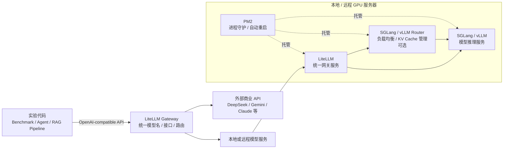

Hi，由于我 ICDE 投稿已经完成了，所以 4000 端口的 Litellm 的 Qwen3-VL-8B-Instruct 模型服务可能不会再维护了[敲打]

不过我会向你推荐我的工作流，主要是以下几点：

整体调用关系大概如下：

1. 使用 SGLang/vLLM 部署模型，而不是代码当中临时加载。

对于大模型而言，需要占用的显存很大，尤其是当你把上下文调得很高的时候 (我注意到你的请求都是很长的请求，token 有几万十几万甚至更多)。以 Qwen3-VL-8B-Instruct 为例，模型本身权重就要占用 16GB 左右，为上下文窗口所预留的 KV Cache，每 64k 上下文就需要占用 9GB，附加一些预留显存，想部署稳定、舒适的 64k 上下文的 Qwen3-VL-8B-Instruct 至少需要 40GB 显存。

在代码当中临时加载模型，很容易会因为显存问题而启动失败或者跑到一半 OOM；而预先部署模型，会先把显存占用好，将后端分离出来，从而避免各种因为模型服务问题导致代码进程中断的情况。

此外，作为专业的高性能推理/部署框架，SGLang/vLLM 能将你的实验速度翻几十倍上百倍，对于大规模的高并发实验是不可或缺的；

更为重要的是，它允许你将模型推理计算放在其他服务器上，因此当你感觉“显卡不够用”，而其他服务器有显卡可用的时候，你不用整体迁移项目，而只需要在目标服务器上部署好模型服务并在本机调用即可，省去了很多麻烦。

2. 使用 PM2 托管长时间任务/进程与常驻服务；

PM2 是一个很强大的进程管理工具，我们所用到的核心功能是应用守护与自动重启。

通过使用 PM2 托管模型服务，能够在模型服务因为某些意外而中断 (例如之前我的 vLLM 经常因为占用内存过大而被系统 SIGKILL) 的情况下，自动重启进程，从而维持服务长时间有效。此外，PM2 的其他功能也能让你更好地管理服务，这会比只是开个 tmux 终端更加适合于常驻型服务。

3. 配置 LLM Gateway (网关)；

如果你只从一个来源调用 LLM，那么没有网关也没事，但实际情况往往不是这样：你可能既要调用本地的 Qwen3 模型，又要调用 Deepseek 等其他来源的模型；或者是不同来源模型所采用的接口协议不同，例如 Gemini/Claude 均有各自的接口协议；又或者是你感觉计算太慢，在多台服务器上同时部署了模型，而你想同时调用它们以最大化效率。种种情况下，配置一个 LLM Gateway 都显得非常有必要。

我推荐使用 Litellm，这是一个非常轻量级的 LLM Gateway，通过将不同来源的模型服务注册到 Litellm 上，你就可以通过统一的端口与 OpenAI 协议来调用它们，而不用在代码当中针对不同模型服务写不同的调用逻辑；而当你在一台新的服务器上部署了模型服务后，也只需要在 Litellm 当中添加配置即可，不用改代码，便于维护和扩展。例如最近几天我赶 ICDE，在外面租了十多张显卡来帮忙跑实验，就是只用简单修改配置，即可轻松扩展算力，帮助我在一天内完成了数十亿 token 级别的实验。

(可选) 针对本地部署的模型，除了 Litellm 以外，还可以在 Litellm 与实际的 SGLang/vLLM 模型服务之间再加一层路由，即官方的 SGLang/vLLM Router，这样做的好处是可以充分利用 SGLang/vLLM Router 的负载均衡与 KV Cache 管理功能，从而进一步提升运算效率；
